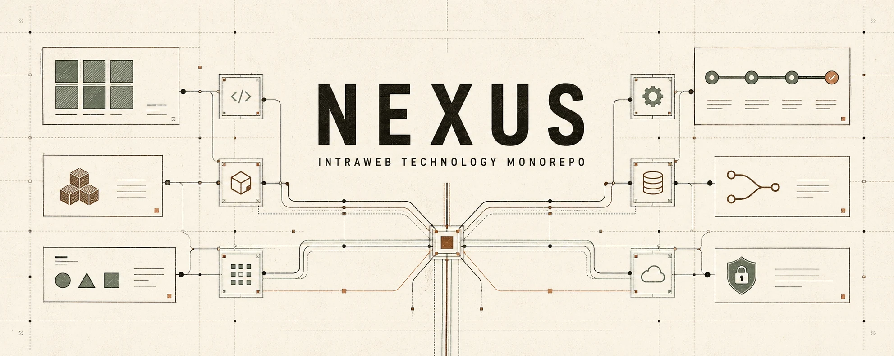
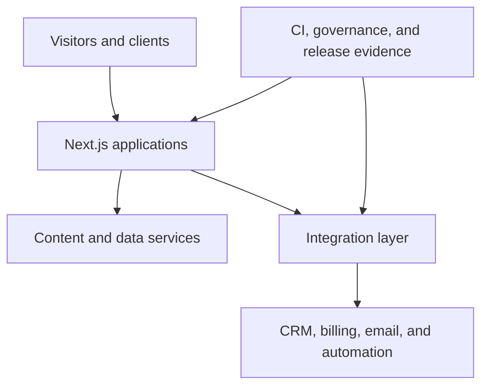

<p align="center">
  <strong>Production applications, shared platform code, content infrastructure, and engineering operations for IntraWeb Technology.</strong>
</p>

<p align="center">
  <a href="https://github.com/IntraWeb-Technology/nexus/actions/workflows/ci.yml"></a>
  
  
  
</p>

## Overview

Nexus is a pnpm and Turborepo monorepo that keeps IntraWeb Technology's customer-facing applications, internal portal, shared CMS, automation assets, and operational tooling in one governed codebase.

The repository is organized around four boundaries:

- **Applications** own user experiences and deployment configuration.
- **Shared packages** own reusable contracts, integration code, configuration, and operational tooling.
- **Content infrastructure** keeps editorial content separate from portal authentication, billing, and operational data.
- **Engineering controls** define affected-package CI, release evidence, and scoped AI-assisted development rules.

## Applications

| Workspace | Purpose | Stack | Local |
| --- | --- | --- | --- |
| [`apps/atlas-web`](./apps/atlas-web/) | Atlas portfolio frontend and long-form engineering case studies | Next.js 16, React 19, TypeScript, Tailwind CSS 4, Playwright, axe | [localhost:3020](http://localhost:3020) |
| [`apps/iw-site-q2`](./apps/iw-site-q2/) | IntraWeb Technology marketing, contact, intake, and booking experiences | Next.js 16, React 19, Tailwind CSS 4 | [localhost:3010](http://localhost:3010) |
| [`apps/iw-portal`](./apps/iw-portal/) | Authenticated client workspace for projects, billing, documents, messages, and change orders | Next.js 16, Clerk, Supabase, Stripe, HubSpot | [localhost:3002](http://localhost:3002) |
| [`apps/cms-strapi`](./apps/cms-strapi/) | Multi-site editorial CMS for Atlas and IntraWeb content | Strapi 5, TypeScript, PostgreSQL/SQLite | [localhost:1337](http://localhost:1337) |

Supporting app trees intentionally outside the root pnpm graph:

| Path | Boundary |
| --- | --- |
| [`apps/atlas-docs`](./apps/atlas-docs/) | Atlas engineering handbook; Yarn 4 and its own Vercel configuration |
| `apps/cms-strapi-docs` | Documentation submodule; not initialized or installed by the root workspace |
| `apps/personal-site` | Nested monorepo with independent tooling |
| [`apps/ai-ops`](./apps/ai-ops/) | Agent OS and process documentation; no runtime package |

## Shared packages

| Package | Responsibility |
| --- | --- |
| [`@repo/strapi-client`](./packages/strapi-client/) | Typed Strapi queries, normalization, and publishing contracts |
| [`@repo/integrations`](./packages/integrations/) | Shared integration boundaries and adapters |
| [`@repo/env`](./packages/env/) | Environment resolution and validation utilities |
| [`@repo/ops`](./packages/ops/) | Stack diagnostics and Vercel environment operations |
| [`@repo/n8n-workflows`](./packages/n8n-workflows/) | Versioned n8n workflows and controlled pull, sync, and push scripts |
| [`@repo/eslint-config`](./packages/eslint-config/) | Shared ESLint configuration |
| [`@repo/typescript-config`](./packages/typescript-config/) | Shared TypeScript configuration |

## Platform architecture



- Atlas consumes code-managed content plus a bounded Strapi surface for articles and documentation. Its current hybrid contract is documented in the [Atlas README](./apps/atlas-web/README.md).
- The marketing site integrates contact, intake, scheduling, CRM, and email flows.
- The portal owns authenticated operational workflows and keeps that data outside the editorial CMS.
- n8n assets are versioned in the repository, while credentials remain in the runtime environment.

For system boundaries and production-critical flows, read the [system overview](./docs/architecture/system-overview.md) and [integration map](./docs/architecture/integration-map.md).

## Getting started

### Prerequisites

- Node.js `22.x`
- Corepack
- pnpm `10.33.0`

```sh
corepack enable
corepack prepare pnpm@10.33.0 --activate
pnpm install --frozen-lockfile
```

Start every workspace that exposes a `dev` task:

```sh
pnpm dev
```

For normal development, run only the application you are changing:

```sh
pnpm --filter @repo/atlas-web dev
pnpm --filter @repo/iw-site-q2 dev
pnpm --filter @repo/iw-portal dev
pnpm --filter cms-strapi dev
```

The Next.js applications can render their local shells without production credentials. Features backed by Clerk, Supabase, Stripe, HubSpot, Resend, n8n, Strapi, reCAPTCHA, or other external services require the relevant app-level environment configuration. Do not commit `.env` files. See the [environment contract](./docs/architecture/environment-contract.md) for exact variable names and ownership.

## Build and validation

Run the complete root checks:

```sh
pnpm lint
pnpm check-types
pnpm test
pnpm build
```

Run the same affected-package task set used by CI:

```sh
pnpm ci:affected
```

Atlas functional browser coverage runs separately from the root unit-test task:

```sh
pnpm --filter @repo/atlas-web test:e2e:functional
```

Visual snapshots are configured, but they are not part of the required CI Gate. Live Strapi production journeys are also outside the current blocking gate. See [CI affected-package detection](./docs/architecture/ci-affected.md) for the exact behavior.

## CI and deployment

GitHub Actions detects affected packages and fails closed when the comparison cannot be resolved.

```text
Detect affected → lint + typecheck + unit tests + build → Atlas fixture E2E when applicable → CI Gate
```

- [CI](./.github/workflows/ci.yml) runs for pushes and pull requests targeting `main` or `development`.
- Branch protection should require the stable **CI Gate** job.
- Each Next.js application owns its own `vercel.json`; there is intentionally no repository-root Vercel configuration.
- Vercel projects must use the corresponding app directory and include files outside that directory so the root lockfile and workspace packages remain available.
- [Deploy](./.github/workflows/deploy.yml) builds the Strapi Docker target when affected. Production compose application remains operator-owned.

| Deployable | Platform | Project root |
| --- | --- | --- |
| Client portal | Vercel | `apps/iw-portal` |
| Marketing site | Vercel | `apps/iw-site-q2` |
| Atlas frontend | Vercel | `apps/atlas-web` |
| Atlas handbook | Vercel, independent Yarn build | `apps/atlas-docs` |
| Strapi CMS | Docker / Hostinger workflow | `apps/cms-strapi` |

Operational details, smoke tests, and rollback boundaries live in the [deployment runbook](./docs/architecture/deployment-runbook.md).

## AI-assisted engineering governance

Nexus permits AI-assisted implementation, but repository truth remains with versioned requirements, architecture decisions, design authority, tests, CI, and human release ownership.

Atlas-scoped work is governed by the approved [Atlas AI-Assisted Engineering Governance V1](./docs/governance/atlas-ai-assisted-engineering-v1.md), its [authority map](./docs/governance/authority-map.md), and documented [exceptions](./docs/governance/exceptions.md). These controls apply to Atlas paths; they should not be represented as universal CI enforcement across unrelated Nexus applications.

Contributors and coding agents must also follow [`AGENTS.md`](./AGENTS.md) and any more specific instructions inside the workspace they change.

## Repository map

```text
.
├── apps/                 # Deployable products and independently tooled app trees
├── packages/             # Shared contracts, integrations, configuration, and operations
├── docs/                 # Architecture, governance, automation, audit, and runbooks
├── .github/              # Affected detection, CI, deployment, and contribution templates
├── AGENTS.md             # Repository-wide agent and development guidance
├── pnpm-workspace.yaml   # Root workspace membership and explicit exclusions
└── turbo.json            # Task graph, cache outputs, and environment allowlists
```

## Documentation index

| Topic | Start here |
| --- | --- |
| Platform architecture | [`docs/architecture/system-overview.md`](./docs/architecture/system-overview.md) |
| Integration ownership | [`docs/architecture/integration-map.md`](./docs/architecture/integration-map.md) |
| Environment variables | [`docs/architecture/environment-contract.md`](./docs/architecture/environment-contract.md) |
| CI selection and gates | [`docs/architecture/ci-affected.md`](./docs/architecture/ci-affected.md) |
| Deployment and rollback | [`docs/architecture/deployment-runbook.md`](./docs/architecture/deployment-runbook.md) |
| Portal documentation | [`docs/portal/`](./docs/portal/) |
| Automation operations | [`docs/automations/`](./docs/automations/) |
| Strapi migration | [`docs/strapi-migration/`](./docs/strapi-migration/) |
| Atlas engineering contract | [`apps/atlas-docs/content/architecture/build-manifest.mdx`](./apps/atlas-docs/content/architecture/build-manifest.mdx) |
| Atlas governance | [`docs/governance/atlas-ai-assisted-engineering-v1.md`](./docs/governance/atlas-ai-assisted-engineering-v1.md) |

## Working agreements

- Keep application-specific deployment settings inside the application directory.
- Add build-time environment variables to the appropriate Turborepo allowlist when code consumes them.
- Use `packages/n8n-workflows/scripts` as the source of truth for n8n synchronization.
- Do not initialize excluded or nested workspaces through the root pnpm graph.
- Never commit credentials, production exports, or local environment files.
- Treat passing checks as evidence for the tested commit, not as proof of untested integrations or production state.

Nexus is maintained by [IntraWeb Technology](https://www.intrawebtech.com/).
