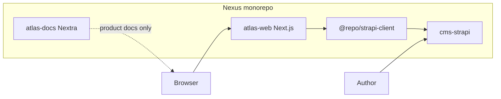
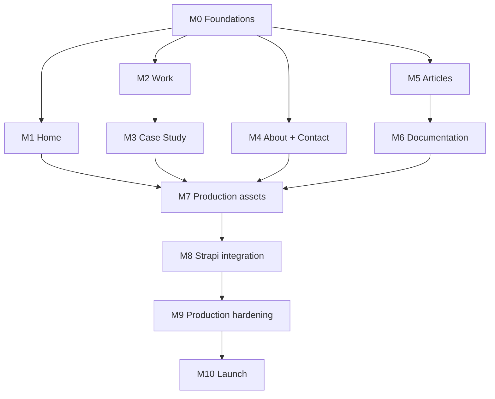

# Atlas Build Manifest

**Status:** Approved — implementation contract  
**Frontend architecture:** **v1.0 frozen** (M0–M3 Proven) — see [Architecture Freeze](/docs/architecture/architecture-freeze)  
**Design status:** Atlas Design v1.0 frozen  
**Canonical Figma:** Atlas Design System (`6r1KqLmwiB8TUXjyedezom`)  
**Homepage pilot:** Implemented — see [Homepage Pilot](/docs/architecture/homepage-pilot)  
**Work route:** Implemented — see [Work Route](/docs/architecture/work-route)  
**Case study:** Implemented (fixture-first) — see [Case Study Route](/docs/architecture/case-study-route)  
**About + Contact:** Implemented — see [About + Contact Route](/docs/architecture/about-contact-route)  
**Next milestone:** M5 — Articles (Blog) publishing surface (do not expand beyond Manifest scope)

---

## Authority

| Layer | Source of truth |
| --- | --- |
| Visual identity & page composition | Figma pages 15–26 (frozen) |
| Product / CMS / frontend rules | Nexus Cursor rules (`atlas-*`, `no-overengineering`, `nexus-architecture`) |
| Implementation contract | **This Build Manifest** |
| Monorepo CI / deploy | `/docs/architecture/*` |

If implementation and Figma disagree, **Figma wins** for visuals. If implementation and this manifest disagree on engineering boundaries, **update the manifest first**.

### Frozen design pages (do not redesign)

| Figma page | Role |
| --- | --- |
| 01 Design Language · 12 Identity · 14 IA | Foundations |
| 15 Homepage | Reference implementation |
| 16 Editorial Brand System | Tokens, type, surfaces, motion, annotation |
| 17 Visual Regression Board | Completeness gate |
| 18 Work · 19 Case Study · 20 About | Page family |
| 21 Case Study Template | Canonical article structure |
| 22 Documentation · 23 Contact | Page family |
| 24 Navigation System · 25 Editorial Image Direction | Chrome & evidence imagery |
| 26 Editorial Publishing System | Reusable content patterns |

---

## 1. Project overview

### Purpose

Atlas is the greenfield rebuild of **johnschibelli.dev**: an **engineering publication** — case studies, documentation, and evidence — not a marketing theme.

### Goals

- Ship core journeys: Home, Work, Case Study, About, Contact, Articles, Documentation.
- Match frozen editorial design (type, color, surfaces, nav, publishing patterns).
- Prove engineering through evidence (figures, diagrams, CI, repos) — never decoration.
- Use shared `apps/cms-strapi` with site key `personal`; isolate from IntraWeb (`intraweb`).
- Stay inside Nexus affected CI / Vercel conventions.

### Scope (v1 launch)

- `apps/atlas-web` as the production frontend.
- Content for site `personal` via `apps/cms-strapi` + `@repo/strapi-client`.
- Routes and components justified by approved Figma only.
- Accessibility, SEO, testing, and performance baselines documented here.

### Non-goals (v1)

- Accounts, dashboards, personalization, AI chat, advanced search, live GitHub metrics.
- Second Strapi instance or Atlas-only CMS.
- Generic page builder / unrestricted dynamic zones.
- Plugin system, DSL, runtime layout engine, universal section registry.
- Extracting shared UI packages without a second real consumer.
- Redesigning frozen Figma pages during implementation.

### Definition of Done (launch)

- All v1 routes render Desktop / Tablet / Mobile against approved compositions.
- Strapi-backed content filtered by `personal`; no IntraWeb leakage.
- Critical Playwright journeys + a11y checks green on affected CI.
- Visual regression snapshots for stable pages at three breakpoints.
- SEO metadata + redirects for migrated URLs where required.
- Contact form works with spam protection; failures degrade gracefully.
- Build Manifest checklist (§18) all **YES**.

### Success criteria

- Recruiter / engineering-leader visit completes Work → Case Study → Contact without confusion.
- Lighthouse / lab budgets met per §8 (document targets; measure in CI later).
- Authors can publish a case study using approved patterns without inventing layout.
- Another senior engineer can implement from this manifest with minimal ambiguity.

---

## 2. Application architecture



### App boundaries

| App | Package | Role |
| --- | --- | --- |
| `apps/atlas-web` | `@repo/atlas-web` | Production site (johnschibelli.dev) |
| `apps/atlas-docs` | (Yarn/Nextra; not in pnpm graph yet) | Product / architecture docs |
| `apps/cms-strapi` | `cms-strapi` | Shared CMS (`personal` + `intraweb`) |
| `packages/strapi-client` | `@repo/strapi-client` | Server-only Strapi access |

### Shared code policy

- Prefer `@repo/strapi-client`, `@repo/typescript-config`, `@repo/eslint-config`.
- Keep Atlas UI in `apps/atlas-web`. No `packages/atlas-*` until ≥2 real consumers.
- Do not import Strapi client into Client Components.

### Feature ownership

| Feature | Owner |
| --- | --- |
| Routes / RSC pages | `atlas-web` `app/` |
| Section compositions | `atlas-web` `components/sections/` |
| Publishing primitives | `atlas-web` `components/editorial/` |
| Chrome (nav, footer, progress) | `atlas-web` `components/chrome/` |
| Tokens / global CSS | `atlas-web` `styles/` |
| CMS mapping | `atlas-web` `lib/strapi/` + `@repo/strapi-client` |
| Schema changes | `cms-strapi` (with IntraWeb regression) |

### Folder structure (actual — M0–M4)

```text
apps/atlas-web/src/
├── app/
│   ├── layout.tsx              # fonts, SiteNavActive, SiteFooter
│   ├── page.tsx                # /
│   ├── about/page.tsx          # /about
│   ├── contact/page.tsx        # /contact
│   ├── api/contact/route.ts    # Resend delivery
│   └── work/
│       ├── page.tsx            # /work
│       └── [slug]/page.tsx     # /work/portfolio-os
├── components/
│   ├── chrome/                 # Nav, Footer, ReadingProgress
│   ├── editorial/              # ChapterMarker, Figure, MetadataRow, Toc, Table, Diagram
│   └── sections/               # page-local compositions (home-*, work-*, case-*, about-*, contact-*)
├── content/
│   ├── types.ts
│   ├── homepage.ts
│   ├── work.ts
│   ├── about.ts
│   ├── contact.ts
│   ├── case-study.ts
│   └── case-studies/
├── lib/
│   ├── contact-validation.ts
│   ├── contact-email.ts
│   └── rate-limit.ts
├── styles/
│   └── globals.css
└── e2e/                        # Playwright (homepage, work, case-study, about, contact)
```

No `packages/atlas-*`. No `lib/strapi` yet (deferred until live CMS). Flat `app/` is acceptable; `(site)` group remains optional.

### Route structure

App Router under `app/(site)/…`. No auth middleware for v1 public site. Optional draft preview via existing Strapi preview secret pattern.

### Assets

- **CMS media** for case/work evidence (preferred).
- **`public/`** for favicon, OG defaults, logo SVG.
- Diagrams may be SVG in-repo when they are design-system diagrams, not one-off content.

### Static vs dynamic content

| Kind | Strategy |
| --- | --- |
| Home / About structure | Mostly static section components; copy from CMS singles or typed fields |
| Work index | CMS `project` (+ featured flags) |
| Case study | CMS `case-study` (extended fields — §6) |
| Articles | Fixture-first chronological publishing surface; CMS `article` later |
| Documentation | Hybrid: static category IA + CMS “recent” articles/notes |
| Contact | Static UI + server action / API for submit |
| Nav labels | Hardcoded to match Figma chrome; CMS nav optional later |

---

## 3. Route inventory

Breakpoints required for every page: **1440 / 768 / 390** (Figma). Auth: **none** (public).

| Route | Purpose | Layout | Required sections (Figma) | Key components | CMS? | SEO | Structured data | Tests | Status |
| --- | --- | --- | --- | --- | --- | --- | --- | --- | --- |
| `/` | Homepage | Site chrome | Recognition, Featured, Selected, Philosophy, Writing, About teaser, Contact | Nav, Footer, figures, chapter markers | Partial | Site + page | `WebSite` | Journey + a11y + visual | **Implemented** (pilot) |
| `/work` | Work index | Site chrome | Intro, Featured, Selected, Taxonomy, Contact | Project sections, taxonomy list | Fixture | Collection | `CollectionPage` | Journey + visual | **Implemented** (fixture-first) |
| `/work/[slug]` | Case study | Site chrome + TOC/progress | Header, TOC, Hero, Overview… Contact (template 21) | Article header, TOC, figures, diagrams, evidence, related | Fixture | Article | `Article` / `TechArticle` | Journey + visual | **Implemented** (Portfolio OS fixture-first) |
| `/about` | Editorial profile | Site chrome | Opening, Philosophy, Approach, Style, Principles, Timeline, Focus, Reading, Architecture, Notes, Contact | Pull quote, timeline, diagrams | Fixture | Profile | `ProfilePage` / `Person` | Journey + visual | **Implemented** (fixture-first) |
| `/articles` | Articles index | Site chrome | Header, Featured article, Article list, Topics, Newsletter/contact cue | Article cards, metadata rows, tags | Fixture | Collection | `CollectionPage` | Journey + visual | M5 |
| `/articles/[slug]` | Article detail | Site chrome + TOC/progress | Article patterns from 26 | Article header, TOC, figures, callouts, related, prev/next | Fixture | Article | `Article` / `TechArticle` | Journey + visual | M5 |
| `/docs` | Handbook landing | Site chrome | Header, Search UI, Categories, Recently Updated, Progress note | Search field, category cards, list rows | Partial | Collection | `CollectionPage` | Journey | M6 |
| `/docs/[…slug]` | Doc article | Site chrome + progress | Article patterns from 26 | Editorial primitives | Fixture/CMS later | Article | `TechArticle` | Journey + visual | M6 |
| `/contact` | Conversation starter | Site chrome | Quiet hero + 3-field form | Form controls | Form only | Contact | — | Journey + form | **Implemented** (Resend delivery) |
| `/404` | Not found | Minimal chrome | Message + links home/work | — | No | `noindex` | — | 404 journey | Required |
| `/robots.txt` | Crawlers | — | — | — | No | — | — | Smoke | Required |
| `/sitemap.xml` | Index | — | — | — | Derived | — | — | Smoke | Required |

### Notes

- **`/projects` → `/work`:** prefer `/work` to match Figma; add redirects from legacy URLs (§10).
- **Articles:** now launch scope as the chronological engineering publication surface; keep distinct from Documentation.
- **Search on `/docs`:** UI pattern approved; backend may be static filter or deferred pagefind — decide in impl milestone without inventing AI search.

---

## 4. Component inventory

Only components justified by Pages 15–26. **Frontend owns layout.** Props are contracts — not an invitation to genericize.

### Chrome

| Component | Purpose | Props (conceptual) | A11y | Responsive | CMS? | Images? | Test priority | Extract? | Order |
| --- | --- | --- | --- | --- | --- | --- | --- | --- | --- |
| `SiteNav` | Sticky publication chrome | `active: 'work'\|'about'\|'contact'\|'articles'\|null` | Landmark + current page | D 60 / T 56 / M condensed | No | No | P0 | No | 1 |
| `SiteFooter` | Footer links + mark | — | Nav list | Same padding scale | No | No | P1 | No | 1 |
| `ReadingProgress` | Sage track under nav | `value 0–1` | Optional `aria-valuenow` | Case/docs long form | No | No | P1 | No | 4 |
| `CaseStudyToc` | In-page anchors | `items[]` | Nav | Desktop rail / mobile sheet later | No | No | P1 | No | 4 |

### Editorial primitives (from Page 26)

| Component | Purpose | Key props | A11y | Responsive | CMS? | Images? | Priority | Order |
| --- | --- | --- | --- | --- | --- | --- | --- | --- |
| `ChapterMarker` | Tracked uppercase label | `children` | Not a heading substitute | — | No | No | P0 | 2 |
| `Figure` | Evidence surface + caption | `src`, `alt`, `caption`, `kind` | `figure`/`figcaption` | Full width → stack | Media | Yes | P0 | 2 |
| `PullQuote` | Editorial emphasis | `children`, `attribution?` | Quote semantics | Scale type | Copy | No | P1 | 3 |
| `Callout` | Note / tradeoff / warning… | `variant`, `title?`, `children` | Aside / region | Full width | Optional | No | P1 | 3 |
| `MetadataRow` | Quiet mono Label · value | `items[]` | Description list preferred | Wrap → stack | Fields | No | P0 | 2 |
| `Timeline` | Date · title · note | `entries[]` | Ordered list | Stack | Fields | No | P1 | 5 |
| `CodeBlock` | Code evidence | `code`, `language`, `caption?` | Pre/code; copy button labeled | Wrap/scroll | Optional | No | P1 | 5 |
| `TerminalBlock` | Terminal evidence | `lines[]`, `caption?` | Pre | Full width | Optional | No | P2 | 6 |
| `EditorialTable` | Comparison / matrices | `columns`, `rows` | Table headers | Scroll-x or stack defs | Optional | No | P1 | 5 |
| `EvidenceBlock` | Deploy/CI/test proof | `kind`, `meta`, `href?` | Status not color-only | Stack | Optional | Maybe | P1 | 5 |
| `EmbedCard` | Video/demo/GitHub/Figma | `kind`, `title`, `href` | Link name | Full width | Optional | Maybe | P2 | 7 |
| `ListBlock` | Ordered / checklist / etc. | `variant`, `items` | Correct list type | — | Copy | No | P2 | 6 |

### Section compositions (page-specific; not a registry)

Implement as explicit components matching Figma section names, e.g. `HomeFeaturedWork`, `WorkTaxonomy`, `AboutPrinciples`, `CaseStudyArchitecture`, `DocsCategoryGrid`, `ContactForm`. **Do not** create `SectionRenderer` / dynamic zone mapper for Atlas v1.

### UI primitives

| Component | Purpose | Notes |
| --- | --- | --- |
| `TextLink` / `ButtonLink` | CTA / text links | Match Figma ink elevated CTA; no new variants |
| `TextField` / `TextArea` | Contact form | Focus/error states from brand components when specified |

---

## 5. Design token specification

Document only — implement as CSS variables (Tailwind v4 `@theme` preferred). Values from Page 16.

### Color

| Token | Hex | Usage |
| --- | --- | --- |
| `--atlas-paper` | `#F3F0E9` | Page ground |
| `--atlas-elevated` | `#FFFCF7` | Nav, cards, code (light) |
| `--atlas-secondary` | `#E9E4DA` | Secondary surfaces, media placeholders |
| `--atlas-ink` | `#1A1814` | Primary text, diagrams |
| `--atlas-body` | `#5A554C` | Body / inactive nav |
| `--atlas-muted` | `#8A847A` | Captions, meta |
| `--atlas-umber` | `#5C4A3A` | Chapter markers |
| `--atlas-sage` | `#4A5C56` | Accents, progress, diagram highlights |
| `--atlas-border` | `#D4CEC2` | Hairlines, inputs |

**Forbidden:** purple marketing gradients, badge rainbows, pure `#FFFFFF` as default card fill (use elevated).

### Typography

| Role | Family | Notes |
| --- | --- | --- |
| Display / titles | Newsreader | SemiBold / Medium / Italic for quotes |
| UI / body | Inter | Regular / Medium / Semi Bold |
| Meta / code | JetBrains Mono | Regular / Medium |

Load via `next/font` (self-hosted). No Inter-as-system fallback as the designed face.

### Spacing / layout

| Token | Value | Usage |
| --- | --- | --- |
| Space scale | 4 / 8 / 12 / 16 / 20 / 24 / 28 / 32 / 40 / 48 / 56 / 64 / 72 | Prefer these |
| Page pad D/T/M | 64 / 40 / 24 | Horizontal |
| Nav height D/T/M | 60 / 56 / 52 | Fixed chrome |
| Reading width | ~720px | Long prose columns |
| Page max | 1440px | Frame width |

### Radius / borders / elevation

| Token | Value |
| --- | --- |
| Radius | `0` default · `2px` elevated cards/inputs · max `4px` |
| Borders | `1px` UI · `1.5px` diagram strokes |
| Elevation | Surface color change — **no multi-layer shadows** as brand default |

### Breakpoints

| Name | Width |
| --- | --- |
| mobile | `< 768` |
| tablet | `768–1439` |
| desktop | `≥ 1440` |

### Motion

| Token | Guidance |
| --- | --- |
| Duration | 150–300ms UI; longer only for intentional editorial motion |
| Easing | Standard ease-out |
| `prefers-reduced-motion` | Disable non-essential motion |

### Z-index

| Layer | z |
| --- | --- |
| Base | 0 |
| Sticky nav | 40 |
| TOC / overlays | 50 |
| Modal (if any) | 60 |

### Naming

- CSS: `--atlas-*`
- Tailwind theme keys mirror tokens (`atlas-ink`, …)
- No parallel token packages for v1

---

## 6. Strapi mapping

### Instance & site

- **Must** use `apps/cms-strapi`.
- Atlas site key: **`personal`** (domain johnschibelli.dev).
- Every query filters by site at the API boundary via `@repo/strapi-client`.
- Tags ≠ tenancy.

### Existing collections (audit)

| Collection | Atlas use | Fit |
| --- | --- | --- |
| `site` | Tenancy root | Reuse |
| `site-setting` | Defaults, SEO, CTAs | Reuse / extend carefully |
| `navigation` | Optional; chrome may stay code | Reuse if needed |
| `project` | Work index cards | Reuse; map taxonomy via tags/categories or enum |
| `case-study` | Case studies | **Gap** — current fields are marketing (`clientName`, challenge/solution/results) |
| `article` | Articles / docs / notes / ADRs | Reuse with categories; contentFormat already exists |
| `page` + `sections` DZ | Marketing blocks | **Do not expand** into Atlas page builder |
| `technology` | Metadata | Optional |
| `author` | About / articles | Optional |
| `redirect` | Legacy URLs | Reuse |
| `testimonial` / `service` / `faq-item` | — | **Out of Atlas v1** |

### Recommended Atlas content model (additive)

Prefer **structured types + controlled components**, not free-form DZ.

1. **Extend `case-study` (or add `atlas-case-study` only if IntraWeb compatibility forbids reshape)** with editorial fields aligned to template 21:
   - `role`, `status`, `year`, `stack` (or tech relations), `repositoryUrl`
   - Sections as **repeatable components** e.g. `case.overview`, `case.problem`, `case.constraints`, `case.architecture` (media + rich text), `case.decision` (repeatable), `case.artifact` (media + kind + caption), `case.outcome`, `case.lesson`
   - Keep `seo` shared component; `sites` M2M
2. **`project`** — keep for Work cards; `featured`, summary, image, link to related case study.
3. **`article`** — Articles and Documentation categories via `category` / `type`; use for engineering notes / ADRs / playbooks. Avoid inventing five collections.
4. **Singletons / site-setting** — About body fields or a dedicated `about-page` single type scoped to site if needed.
5. **Contact** — do not store messages in Strapi unless required; prefer form → email/CRM.

### Dynamic zones

- **Not for Atlas page assembly.**
- Existing `Page.sections` remains for other consumers; Atlas pages are React compositions.

### Media / SEO / slugs / i18n / workflow

| Topic | Decision |
| --- | --- |
| Media | Strapi media library; alt required in editorial QA |
| SEO | `shared.seo` on entries |
| Slugs | UID from title; stable; redirects on change |
| Localization | English only for v1 (`defaultLocale` en) |
| Draft/publish | Existing draftAndPublish; preview via `STRAPI_PREVIEW_SECRET` |
| Site separation | Filter `personal` always |

### Client extensions

Extend `@repo/strapi-client` with any new getters/normalizers; Zod domain types; never raw DTOs in UI.

---

## 7. Asset manifest

Track in a living sheet (or CMS) before launch. Status: **Needed** until captured.

| ID | Asset | Owner | Priority | Aspect | Alt / notes | Responsive | Source |
| --- | --- | --- | --- | --- | --- | --- | --- |
| A-01 | Homepage hero / Portfolio OS shot | Design/Eng | P0 | Full-bleed | Product surface | D/T/M crops | Production UI |
| A-02 | Work featured media | Eng | P0 | 16:9 | Portfolio OS | Yes | Production |
| A-03–A-05 | Selected work media (3) | Eng | P0 | Per card | Named project | Yes | Production |
| A-06 | Case study hero | Eng | P0 | Wide | Case subject | Yes | Production |
| A-07 | Architecture diagram | Eng | P0 | Landscape | System boundaries | Labels scale | Figma/SVG |
| A-08 | Workflow / delivery diagram | Eng | P1 | Wide | Pipeline stages | Yes | Figma/SVG |
| A-09 | CI/CD capture | Eng | P1 | Wide | Honest status | Yes | Actions UI |
| A-10 | Repo structure | Eng | P1 | Tall | Paths | Yes | IDE/GitHub |
| A-11 | Terminal / Playwright | Eng | P1 | Wide | Commands | Yes | Local/CI |
| A-12 | Docs screenshot | Eng | P2 | Content | Handbook | Yes | atlas-docs |
| A-13 | OG default | Design | P0 | 1200×630 | Site name | — | Export |
| A-14 | Favicon / logo mark | Design | P0 | SVG | Atlas | — | Brand |
| A-15 | About diagrams | Design | P1 | Per fig | Approach / layers | Yes | Figma |

**Hard ban:** stock photos, AI art, decorative abstracts, logo walls.

---

## 8. Performance strategy

Decisions only — no premature optimization.

| Topic | Decision |
| --- | --- |
| Rendering | Static / prerender public pages; ISR or on-demand revalidate when CMS updates |
| Dynamic | Contact submit + preview only |
| Images | `next/image`; CMS sizes; explicit width/height; no unoptimized remote without allowlist |
| Lazy loading | Below-fold figures; priority on LCP hero only |
| Fonts | `next/font`; subset; avoid layout shift |
| JS | RSC default; client islands only for form, mobile nav sheet, progress |
| Bundle | No UI kit grab-bag; no chart libs unless a page requires |
| Caching | CDN via Vercel; `revalidateTag` per site/entry when wired |
| Prefetch | Next defaults for in-viewport links; no speculative route spam |
| Streaming | Use App Router defaults where beneficial; don’t force |

**Budgets (targets):** LCP ≤ 2.5s lab mid-tier; CLS ≤ 0.1; minimize TBT via RSC.

---

## 9. Accessibility strategy

| Topic | Decision |
| --- | --- |
| Target | WCAG 2.2 AA |
| Keyboard | All interactive controls; skip link to main |
| Focus | Visible ink focus ring; never `outline: none` without replacement |
| Motion | Honor `prefers-reduced-motion` |
| Contrast | Ink/body on paper/elevated validated |
| Headings | One `h1` per page; logical order; chapter markers ≠ headings |
| Figures | Alt + caption; decorative media empty alt only when truly decorative (rare) |
| Tables | Header cells; mobile stacked pattern keeps associations |
| Code | Don’t rely on color alone for diffs |
| Nav | `aria-current="page"` on active |
| Tools | axe/playwright a11y on major routes; keyboard pass |

---

## 10. SEO strategy

| Topic | Decision |
| --- | --- |
| Metadata | Next Metadata API per route; CMS SEO overrides when present |
| OG / Twitter | Default OG image A-13; per-case when featured image exists |
| Canonical | Prefer CMS `canonicalUrl` / absolute production URL |
| Structured data | WebSite, Article/TechArticle for cases, Person on About |
| Sitemap | `app/sitemap.ts` from published entries + static routes |
| Robots | Allow public; disallow preview/draft paths if any |
| RSS | Optional v1.1 for articles; not required for launch |
| Redirects | Map legacy johnschibelli.dev URLs via Strapi `redirect` or `vercel.json` |
| Migration | Preserve SEO value; explicit decision before dropping URLs |

---

## 11. Testing strategy

| Layer | What | Priority |
| --- | --- | --- |
| Unit | Strapi mappers, SEO helpers, URL/slug, form validation | P0 |
| Integration | strapi-client site filters; preview secret | P0 |
| Playwright | Home, Work, Case, About, Contact, Articles, Docs, 404, nav, mobile menu | P0 |
| A11y | Major pages + keyboard | P0 |
| Visual | Stable pages D/T/M with fixture data | P0 |
| CMS | Unpublished hidden; site isolation (no intraweb) | P0 |
| Links | Broken link check in docs + critical site links | P1 |
| Perf | Lab smoke on Home + Case | P1 |
| Hydration | No console errors on client islands | P1 |
| Errors | Strapi down → graceful empty/error UI | P0 |

No coverage vanity targets. Prefer fixtures/seeds over live prod content in CI.

---

## 12. CI/CD strategy

| Topic | Decision |
| --- | --- |
| Affected CI | Existing Turbo affected (`pnpm ci:affected`) — Atlas changes must not force unrelated apps |
| atlas-web | Vercel root `apps/atlas-web`; existing `vercel.json` ignoreCommand |
| atlas-docs | Remains Yarn app until explicitly onboarded to pnpm; deploy separately |
| cms-strapi | Existing deploy workflow when affected; IntraWeb regression on shared schema changes |
| Preview | Vercel previews for atlas-web PRs |
| Visual regression | Playwright snapshots in CI for atlas-web when tests exist |
| Cache | Turbo remote cache as today; don’t invent new pipelines |

**Do not rewrite working Nexus CI.** Add Atlas filters/tests only.

---

## 13. Security

| Topic | Decision |
| --- | --- |
| Headers | Standard Next/Vercel security headers; tighten CSP iteratively |
| CSP | Allow self + Strapi media host + fonts; avoid `unsafe-inline` where practical |
| Forms | Server-side validation; honeypot/CAPTCHA (align with iw-site patterns if reused) |
| Env | `STRAPI_URL`, `STRAPI_API_TOKEN`, `STRAPI_PREVIEW_SECRET` server-only |
| Secrets | Never `NEXT_PUBLIC_` for tokens |
| Images | Remote pattern allowlist for Strapi CDN |
| Rate limit | Contact endpoint rate limit |
| Dependencies | pnpm audit on affected; no drive-by dependency adds |

---

## 14. Documentation plan

| Doc | Location |
| --- | --- |
| Build Manifest (this) | `apps/atlas-docs/content/architecture/build-manifest.mdx` |
| Pointer | `docs/atlas/architecture/README.md` |
| Design exports | `docs/atlas/exports/` |
| Component authoring | atlas-docs (post-impl) |
| CMS editorial guide | atlas-docs |
| Asset guide | atlas-docs + asset sheet |
| Accessibility | atlas-docs |
| Deployment overview | atlas-docs + link Nexus runbooks |
| ADRs | `docs/architecture/` or atlas-docs `adr/` as decisions arise |
| Testing notes | atlas-docs + Playwright README |

Update docs when architecture, CMS, or testing materially changes.

---

## 15. Implementation order

| Milestone | Goal | Depends on | Output | Acceptance | Complexity |
| --- | --- | --- | --- | --- | --- |
| **M0 — Foundations** | Tokens, fonts, layout shell, Nav/Footer | Manifest approval | `globals.css` tokens, `SiteNav`, `SiteFooter` | Matches chrome Figma; D/T/M | **DONE** |
| **M1 — Home** | Homepage sections | M0 | `/` complete | Visual QA vs Page 15; a11y | **DONE** — [report](/docs/architecture/homepage-pilot) |
| **M2 — Work index** | `/work` + project mapping | M0, M1 approval | Work page | Matches Page 18; fixture-first | **DONE** — [report](/docs/architecture/work-route) |
| **M3 — Case study** | Template 21 + CMS fields | M2, schema extension | `/work/[slug]` | Matches template; evidence figures | **DONE** (fixture-first) — [report](/docs/architecture/case-study-route); Strapi wiring deferred |
| **M4 — About + Contact** | Profile + form | M0 · architecture freeze | `/about`, `/contact` | Matches 20/23; form delivers | **DONE** — [report](/docs/architecture/about-contact-route) |
| **M5 — Articles (Blog)** | `/articles` + `/articles/[slug]` | M0, editorial primitives | Articles publishing surface | Chronological index and article detail match Page 26 patterns; fixture-first | M |
| **M6 — Documentation** | `/docs` + `/docs/[…slug]` | M5 editorial primitives, article categories | Documentation system | Matches Page 22; docs articles prove metadata, TOC, nav, related, prev/next | M |
| **M7 — Production assets** | Evidence imagery, OG, favicon, editorial media | M1–M6 | Asset manifest complete | P0 assets captured; no placeholder launch blockers | S/M |
| **M8 — Strapi integration** | CMS wiring for production content | M3, M5, M6, schema decisions | `personal` content via `@repo/strapi-client` | Site isolation; draft safety; fixtures remain testable | M/H |
| **M9 — Production hardening** | Tests, a11y, visuals, perf, security headers, SEO + redirects | M1–M8 | CI green + launch checks | §10–§13; sitemap valid; redirects verified | M |
| **M10 — Launch** | Production release | M9 | johnschibelli.dev launch | Build readiness checklist all YES | S |

No parallel “framework” milestones. Schema work for case studies starts before or at kickoff of M3.

---

## 16. Explicit non-goals

- No plugin system  
- No generic page builder / unrestricted DZ expansion for Atlas  
- No DSL or runtime layout engine  
- No universal section/component registry  
- No speculative shared UI package  
- No custom framework  
- No dependency injection / event bus / global state library  
- No design-token mega-tooling beyond CSS/`@theme`  
- No second Strapi  
- No auth/accounts/dashboards/AI chat/advanced search/live GitHub metrics in v1  
- No rewriting Nexus CI “to be enterprise”  

---

## 17. Risks

| Risk | Likelihood | Impact | Mitigation |
| --- | --- | --- | --- |
| Case-study schema reshape breaks IntraWeb | M | H | Additive fields or Atlas-specific type; dual-site regression |
| Missing real evidence assets delay launch | H | H | Asset manifest owners; placeholders labeled; parallel capture |
| Scope creep into page builder | M | H | Manifest + no-overengineering rule; reject DZ expansion |
| Design/impl drift | M | M | Visual regression vs Figma; VRB gate |
| Strapi outage blanks site | L | H | Graceful empty states; cache/ISR |
| Preview/draft leakage | L | H | Preview secret; no draft in public queries |
| Yarn atlas-docs vs pnpm friction | M | L | Keep docs separate until integration decision |
| Contact spam | M | M | CAPTCHA/honeypot + rate limit |
| Legacy SEO loss | M | H | Redirect inventory before cutover |
| Test flakiness (visual) | M | M | Fixture data; masked dynamic regions |

---

## 18. Build readiness checklist

Every item must be **YES** before implementation starts.

| # | Item | YES/NO |
| --- | --- | --- |
| 1 | Design frozen (Figma 15–26) | YES |
| 2 | Routes defined (§3) | YES |
| 3 | Components documented (§4) | YES |
| 4 | Assets tracked (§7) | YES (sheet to be owned) |
| 5 | CMS mapped (§6) | YES (schema extension plan required for M3) |
| 6 | Accessibility planned (§9) | YES |
| 7 | SEO planned (§10) | YES |
| 8 | Testing planned (§11) | YES |
| 9 | CI/CD understood (§12) | YES |
| 10 | No unresolved architecture questions blocking M0 | YES* |

\*Open questions below are **non-blocking for M0**; resolve before M3 schema merge.

### Open questions (resolve before/at M3)

1. Extend existing `case-study` vs new Atlas-only type?  
2. Docs search: client filter vs pagefind vs defer?  
3. Contact delivery: Resend via `/api/contact` (honeypot + rate limit; no HubSpot/reCAPTCHA Enterprise) — **resolved in M4**  
4. Legacy URL inventory completeness for redirects? 

---

## Architecture diagrams (folder + sequence)

### Folder (logical)

See §2 folder proposal.

### Sequence (launch)



---

## Final architecture critique

### Over-engineering avoided

- No section registry, no DZ page builder, no shared UI package speculation.
- Tokens as CSS variables — not a token pipeline product.
- Explicit section components per page.

### Missing abstractions (intentionally deferred)

- Design-system Storybook for atlas-web — add when component count hurts review, not before M0.
- Full docs article template route — scheduled for M6 after Articles proves the shared editorial primitives.

### Unnecessary abstractions rejected

- “Universal Figure engine” with plugin kinds — use `kind` prop + CSS, not plugins.
- CMS adapter layer beyond `@repo/strapi-client` — forbidden.

### Maintenance risks

- Case-study field growth could recreate a builder — keep components finite and named after template sections.
- atlas-docs Yarn isolation — document deploy path; don’t half-migrate to pnpm mid-sprint.

### Hidden coupling

- Site key `personal` must stay consistent across client, env, and content.
- Nav active states are route-derived in code; don’t fork CMS nav that disagrees with Figma.

### CMS / testing / deploy risks

- Additive schema preferred; always run IntraWeb consumer checks.
- Visual tests need locked fixture content.
- Vercel affected ignoreCommand already scoped — keep Atlas filter tight.

### Verdict

**M0–M3 are complete and frozen** as Atlas Frontend Architecture v1.0. See [Architecture Freeze](/docs/architecture/architecture-freeze). Strapi additive schema merge remains deferred; fixtures document the planned editorial field shape. M4 may begin under freeze constraints.

---

## Proven Patterns

Validated only after production implementation, accessibility, responsive, and visual regression approval. Do not mark unimplemented patterns as validated.

### Validated

- ✓ ChapterMarker — Home + Work + Case Study
- ✓ Figure (+ `tone`, optional `label` / `panels`) — Home, Work, Case Study
- ✓ MetadataRow — Case Study desktop metadata
- ✓ CaseStudyToc — Case Study D/T/M recomposition
- ✓ ReadingProgress — Case Study long-form chrome
- ✓ EditorialTable — Constraints / Delivery / Lessons
- ✓ ArchitectureDiagram — editorial diagram language (hairline, mono IDs)
- ✓ Navigation (`SiteNav` + route-aware active) — chrome
- ✓ Footer (`SiteFooter`) — chrome
- ✓ Page-local section compositions — no section registry
- ✓ Fixture-first Strapi-shaped content modules — `homepage.ts`, `work.ts`, `case-study.ts` (types) + `case-studies/*` (data/registry)
- ✓ RSC default · client islands only for nav active + reading progress
- ✓ Playwright D/T/M + axe + visual baselines
- ✓ Architecture freeze (M0–M3) — [report](/docs/architecture/architecture-freeze)

### Intentionally not extracted (yet)

- ✗ ContactBridge — Home/Work/Case/About compositions still differ; extract when a true shared shell exists
- ✗ StageRule — Work desktop-only annotation
- ✗ Decision matrix shell — Case-local until a second case study proves identical
- ✗ Generic ProjectCard / Card — forbidden; unequal editorial layouts stay in sections
- ✗ PullQuote / Timeline — About-only this milestone; leave local until a second consumer

### Deferred (not in Portfolio OS template)

- Caption as standalone primitive (lives on `Figure` / diagram `figcaption`)
- PullQuote / Callout / EvidenceBlock / Timeline
- CodeBlock / TerminalBlock / RepositoryCard / EmbedCard / Footnotes

---

**Architecture frozen at v1.0 (M0–M3).** M4 (About + Contact) is **DONE**. M5 (Articles / Blog) may begin. Do not start Documentation, additional case studies, or Strapi integration as side quests outside Manifest order.

