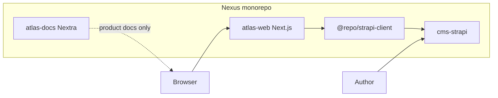
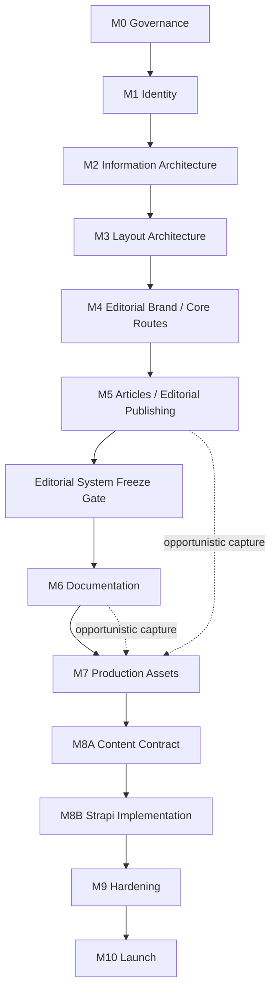

# Atlas Build Manifest

**Status:** Approved — implementation contract  
**As of:** 2026-08-13 (milestones); design-authority addendum **2026-08-27**; Page 28 parity decisions **2026-08-27**.

**Frontend architecture:** **v1.0 frozen** — core routes proven; see [Architecture Freeze](/docs/architecture/architecture-freeze)  
**Design status:** Atlas Design v1.0 remains the frozen Editorial Brand System for unsuperseded surfaces. **Effective 2026-08-27**, Figma **Page 28 / Story-First** is the controlling visual authority for Home, Work index, Portfolio OS case study, Contact, Articles index, and shared chrome (see Authority). Parity decisions of the same date record accepted responsive interpretation, accepted media direction, rejected Work PHOTO tiles, open corrections C1–C9, and viewport **policy** (not yet implemented). This is **not** implementation-parity verification, visual-baseline approval, or Figma-complete implementation.

**Canonical Figma:** Atlas Design System (`6r1KqLmwiB8TUXjyedezom`)  
**Homepage pilot:** Implemented — see [Homepage Pilot](/docs/architecture/homepage-pilot)  
**Work route:** Implemented — see [Work Route](/docs/architecture/work-route)  
**Case study:** Implemented (fixture-first) — see [Case Study Route](/docs/architecture/case-study-route)  
**About + Contact:** Implemented — see [About + Contact Route](/docs/architecture/about-contact-route)  
**Articles / Editorial Publishing:** Implemented — see [Editorial Publishing (M5)](/docs/architecture/editorial-publishing)  
**Documentation:** Implemented — see [Documentation System (M6)](/docs/architecture/documentation-system)  
**Next milestone:** **M9 — Hardening** (M9D art-direction slice implemented; A-05 remains deferred)

---

## Current status (2026-08-13)

| Milestone | Status |
| --- | --- |
| **M0 — Governance / Project Foundations** | **COMPLETE** |
| **M1 — Foundations & Identity** | **COMPLETE** |
| **M2 — Information Architecture** | **COMPLETE** |
| **M3 — Layout Architecture** | **COMPLETE** |
| **M4 — Editorial Brand / Core Route Implementation** | **COMPLETE** |
| **M5 — Articles / Editorial Publishing** | **COMPLETE** |
| Editorial System Freeze Gate | **PASSED** |
| **M6 — Documentation** | **COMPLETE** |
| Documentation Freeze | **PASSED** |
| **M7 — Production Assets** | **COMPLETE** — Freeze **PASS** |
| Production Asset Freeze | **PASS** (A-05 **DEFERRED / NON-BLOCKING**) |
| **M8 — Strapi Integration** | **COMPLETE** — see [M8 Strapi Integration](/docs/architecture/m8-strapi-integration) |
| **M9 — Hardening** | **In progress** — **M9D Art Direction** implemented ([report](/docs/architecture/m9d-art-direction)); remaining hardening gates continue |
| **M10 — Launch** | Planned |

**Program posture:** **Atlas v1 content architecture is hybrid** — see [V1 Content Architecture](/docs/architecture/v1-content-architecture). Articles (and Documentation handbook pages) are Strapi-managed when CMS mode is active (fail-closed). Homepage, Work, case studies, About, Contact, and chrome are **always** code-managed from committed content; Strapi outage must not break those builds. Full-site CMS is deferred. M8 implemented schemas, client contract, assemblers, and integration code for CMS surfaces. **M9D** recorded Approval Polish (Page 27) for chrome, Articles, and shared CTAs; **as of 2026-08-27** Page 28 / Story-First supersedes that polish **only** on the scoped surfaces in Authority below. Fixture mode (`ATLAS_CONTENT_SOURCE=fixture`) remains the Playwright / local demo path for CMS surfaces. **A-05 Vehicle Maintenance** media remains **deferred**.

### Milestone scheme note

Earlier implementation reports used an implementation-local numbering (**M0 Foundations → M1 Home → M2 Work → M3 Case Study**). Those reports remain valid **historical** proof (Homepage Pilot, Work Route, Case Study Route, Architecture Freeze). As of 2026-08-11 this Build Manifest uses the **program-level** milestone scheme above. That earlier core-route work, together with About and Contact, is completed under **M4 — Editorial Brand / Core Route Implementation**. Historical report language that once said “M4 may begin” describes a past clearance state, not the current program status.

---

## Authority

| Layer | Source of truth |
| --- | --- |
| Visual identity & page composition | **Effective 2026-08-27:** Figma **Page 28 / Story-First** for the scoped surfaces below, plus the same-date [Page 28 parity decisions](../../../../docs/governance/decisions/2026-08-27-page-28-parity-decisions.md). Pages 15–26 (frozen) + **Page 27 Approval Polish (§29)** remain controlling where they do not overlap that scope. See also [`docs/governance/authority-map.md`](../../../../docs/governance/authority-map.md). |
| Product / CMS / frontend rules | Nexus Cursor rules (`atlas-*`, `no-overengineering`, `nexus-architecture`) |
| Implementation contract | **This Build Manifest** |
| Monorepo CI / deploy | `/docs/architecture/*` |

If implementation and Figma disagree, **Figma wins** for visuals (Page 28 on scoped Story-First surfaces; Pages 15–26 / 27 otherwise). If implementation and this manifest disagree on engineering boundaries, **update the manifest first**.

### Page 28 / Story-First design authority (effective 2026-08-27)

**Human engineering authority:** John Schibelli (V1 product and release owner).

**Kind:** Explicit design-authority supersession — not an exception or waiver.

Page 28 / Story-First is the controlling visual authority for:

- Home (`/`)
- Work index (`/work`)
- Portfolio OS case study (`/work/portfolio-os`)
- Contact (`/contact`)
- Articles index (`/articles`)
- Shared Atlas chrome: navigation, brand treatment, footer, social links, and mobile menu

For those surfaces and overlapping elements only, Page 28 **supersedes** previously frozen Figma Pages 15–26 and Page 27 Approval Polish.

**Body composition retains prior authority** (Pages 15–26 / 27) for:

- About (`/about`)
- Documentation (`/docs`, `/docs/[…slug]`)
- Article-detail (`/articles/[slug]`)

Shared chrome governed by Page 28 may appear on those routes; their body composition does not move to Page 28.

This supersession does **not** extend to CMS schemas, fixtures, or content contracts; visual-regression tolerances; or production / deployment configuration. Viewport **policy** is a separate 2026-08-27 decision (below); it is **not** implemented by this supersession.

**This decision approves Story-First design direction only.** It does **not** approve:

- current implementation as Page 28–complete or Figma-parity verified
- any visual snapshot (Windows or Linux), including About snapshots from `b5df90c`
- Story-First work-gallery gradient PHOTO placeholders as final media
- opacity-zero or unsettled `Reveal` captures as representative evidence
- snapshot replacement or visual CI readiness
- 768-pixel tablet width as a substitute for V1 §7.3 1024-pixel width

Homepage visual evidence must settle `Reveal` content before it can be considered representative. Tracked Playwright snapshots remain unapproved.

### Page 28 parity decisions (effective 2026-08-27)

**Human engineering authority:** John Schibelli. **Record:** [`docs/governance/decisions/2026-08-27-page-28-parity-decisions.md`](../../../../docs/governance/decisions/2026-08-27-page-28-parity-decisions.md). Figma file `6r1KqLmwiB8TUXjyedezom`, page `616:2`.

These decisions tell implementation agents **what to omit, what not to add, which media directions are accepted, and which corrections remain open**. They do **not** approve current captures, any snapshot, or visual CI.

**Responsive content to omit (Page 28 interpretation):**

- Home **mobile** (`616:18`): abbreviated composition; **omit Writing**.
- Articles **tablet/mobile** (`632:5`, `632:10`): **omit** the fifth Turborepo card.
- Work **tablet/mobile** (`632:3`, `616:19`): use Page 28 **reduced CTA density**.

**Rejected additions (must be removed):**

- Articles **Topics** chips and **CONTINUE** cue — not accepted Story-First additions (all in-scope viewports).

**Accepted media direction (not baseline approval):**

- Home production photography — final media direction, subject to Page 28 crop, placement, and responsive parity.
- Articles cover photograph — final replacement for the COVER placeholder, subject to crop and placement parity.
- Live Portfolio OS schematic — final replacement for the DIAGRAM placeholder.

**Temporary Work media (baseline blocker):**

- Work gradient PHOTO tiles are **rejected as final media**. They may remain temporarily. **Work is blocked from baseline approval** until final imagery is supplied and approved.

**Open corrections (C1–C9; unimplemented):**

| ID | Required correction |
| --- | --- |
| C1 | Home mobile open menu uses warm paper, not inverse ink-blue (`705:33`, `705:67`) |
| C2 | Remove Articles Topics and CONTINUE |
| C3 | Tablet Home uses photo-then-copy and one CTA (`632:2`) |
| C4 | Tablet Portfolio OS stacks Overview (`632:4`) |
| C5 | Restore Contact invitation body copy |
| C6 | Title-case Contact field labels |
| C7 | Home writing title is “Why We Chose React Server Components.” |
| C8 | Rust-filled primary Home CTA; omit “Read the notes” on tablet |
| C9 | Correct tablet footer wrapping/crowding before baseline approval |

**Viewport and breakpoint evidence (policy decided, control unimplemented):**

- Retain V1 §7.3.
- Permanent visual coverage widths: **1440, 1024, 768, 390**.
- Targeted breakpoint evidence: **767/769** and **1439/1441**.
- Full stored baselines are not required at all four boundary widths unless the changed task affects that breakpoint.
- Canonical viewport values must eventually live in one versioned repository location. That file does **not** exist yet. Playwright still uses 1440 / 768 / 390 only. Do not treat this policy sentence as implemented coverage.

**No baseline is approved.** Current Home, Articles, Work, Contact, Portfolio OS, and chrome captures are not approved. Compare-only CI must not be enforced until approved Linux baselines exist after a new Page 28 review.

### Frozen design pages (limited supersession)

The table below is the **prior freeze**. Do not redesign those pages during implementation **except** where Page 28 / Story-First is the recorded controlling authority above.

| Figma page | Role |
| --- | --- |
| 01 Design Language · 12 Identity · 14 IA | Foundations |
| 15 Homepage | Superseded by Page 28 for Home composition |
| 16 Editorial Brand System | Tokens, type, surfaces, motion, annotation (unsuperseded except overlapping Story-First chrome/token use on scoped surfaces) |
| 17 Visual Regression Board | Completeness gate — not a baseline-approval record |
| 18 Work | Superseded by Page 28 for Work index |
| 19 Case Study · 21 Case Study Template | Superseded by Page 28 for **Portfolio OS** only; other case-study bodies retain prior authority until recorded otherwise |
| 20 About | **Retained** for About **body** composition |
| 22 Documentation | **Retained** for Documentation **bodies** |
| 23 Contact | Superseded by Page 28 for Contact |
| 24 Navigation System | Superseded by Page 28 for shared chrome (nav, brand, footer, socials, mobile menu) |
| 25 Editorial Image Direction | Evidence imagery. Home photography and the Articles cover photograph are accepted **media direction** (crop/placement/responsive parity still required). Work gradient PHOTO tiles remain **temporary** and **block Work baseline approval**. |
| 26 Editorial Publishing System | **Retained** for article-detail and Documentation **bodies** (M5/M6 primitives) |
| 27 Approval Polish (§29) | Superseded where it overlaps Page 28 scoped chrome / Articles index / Home / Work / Contact / Portfolio OS |
| **28 Story-First** | **Controlling** for the scoped surfaces listed above |

Page 26 remains the visual authority for reusable Editorial Publishing System primitives on article-detail and Documentation bodies.

---

## 1. Project overview

### Purpose

Atlas is the greenfield rebuild of **johnschibelli.dev**: an **engineering publication** — case studies, documentation, and evidence — not a marketing theme.

### Goals

- Ship core journeys: Home, Work, Case Study, Articles, About, Contact, Documentation.
- Match approved editorial design (Page 28 / Story-First on scoped surfaces; frozen Pages 15–26 / 27 otherwise).
- Prove the Editorial Publishing System (Page 26) via Articles before Documentation depends on it.
- Prove engineering through evidence (figures, diagrams, CI, repos) — never decoration.
- Use shared `apps/cms-strapi` with site key `personal` **at M8** after the frontend contract is proven; isolate from IntraWeb (`intraweb`).
- Stay inside Nexus affected CI / Vercel conventions.

### Scope (v1 launch)

- `apps/atlas-web` as the production frontend.
- Content for site `personal` via `apps/cms-strapi` + `@repo/strapi-client`.
- Routes and components justified by approved Figma only.
- Accessibility, SEO, testing, and performance baselines documented here.

### Non-goals (v1)

- Accounts, dashboards, personalization, AI chat, advanced search, live GitHub metrics.
- Second Strapi instance or Atlas-only CMS.
- Generic page builder / unrestricted dynamic zones.
- Plugin system, DSL, runtime layout engine, universal section registry.
- Extracting shared UI packages without a second real consumer.
- Redesigning frozen Figma pages during implementation, except where Page 28 / Story-First is the recorded controlling authority (see Authority).

### Definition of Done (launch)

- All v1 routes render Desktop / Tablet / Mobile against approved compositions.
- Strapi-backed content filtered by `personal`; no IntraWeb leakage.
- Critical Playwright journeys + a11y checks green on affected CI.
- Visual regression snapshots for stable pages at three breakpoints.
- SEO metadata + redirects for migrated URLs where required.
- Contact form works with spam protection; failures degrade gracefully.
- Build Manifest checklist (§18) all **YES**.

### Success criteria

- Recruiter / engineering-leader visit completes Work → Case Study → Contact without confusion.
- Lighthouse / lab budgets met per §8 (document targets; measure in CI later).
- Authors can publish a case study using approved patterns without inventing layout.
- Another senior engineer can implement from this manifest with minimal ambiguity.

---

## 2. Application architecture



### App boundaries

| App | Package | Role |
| --- | --- | --- |
| `apps/atlas-web` | `@repo/atlas-web` | Production site (johnschibelli.dev) |
| `apps/atlas-docs` | (Yarn/Nextra; not in pnpm graph yet) | Product / architecture docs |
| `apps/cms-strapi` | `cms-strapi` | Shared CMS (`personal` + `intraweb`) |
| `packages/strapi-client` | `@repo/strapi-client` | Server-only Strapi access |

### Shared code policy

- Prefer `@repo/strapi-client`, `@repo/typescript-config`, `@repo/eslint-config`.
- Keep Atlas UI in `apps/atlas-web`. No `packages/atlas-*` until ≥2 real consumers.
- Do not import Strapi client into Client Components.

### Feature ownership

| Feature | Owner |
| --- | --- |
| Routes / RSC pages | `atlas-web` `app/` |
| Section compositions | `atlas-web` `components/sections/` |
| Publishing primitives | `atlas-web` `components/editorial/` |
| Chrome (nav, footer, progress) | `atlas-web` `components/chrome/` |
| Tokens / global CSS | `atlas-web` `styles/` |
| CMS mapping | `atlas-web` `lib/strapi/` + `@repo/strapi-client` |
| Schema changes | `cms-strapi` (with IntraWeb regression) |

### Folder structure (through M4 core routes)

**M4 complete routes:** `/`, `/work`, `/work/[slug]`, `/about`, `/contact` (plus contact API, associated content/components, and Playwright coverage).

Representative tree for Home / Work / Case Study modules (About / Contact follow the same chrome · sections · content · e2e ownership pattern):

```text
apps/atlas-web/src/
├── app/
│   ├── layout.tsx              # fonts, SiteNavActive, SiteFooter
│   ├── page.tsx                # /
│   ├── about/page.tsx          # /about
│   ├── contact/page.tsx        # /contact
│   ├── api/contact/route.ts    # Resend delivery
│   └── work/
│       ├── page.tsx            # /work
│       └── [slug]/page.tsx     # /work/portfolio-os
├── components/
│   ├── chrome/                 # Nav, Footer, ReadingProgress
│   ├── editorial/              # ChapterMarker, Figure, MetadataRow, Toc, Table, Diagram
│   └── sections/               # page-local compositions (home-*, work-*, case-*, about-*, contact-*)
├── content/
│   ├── types.ts                # NavLink, MetaItem
│   ├── homepage.ts
│   ├── work.ts
│   ├── about.ts
│   ├── contact.ts
│   ├── case-study.ts           # CaseStudyFixture domain types (Strapi mapping target)
│   └── case-studies/
│       ├── index.ts            # slug registry
│       └── portfolio-os.ts     # fixture data
├── lib/
│   ├── contact-validation.ts
│   ├── contact-email.ts
│   └── rate-limit.ts
├── styles/
│   └── globals.css             # tokens + utilities
└── e2e/                        # Playwright (homepage, work, case-study, about, contact)
```

No `packages/atlas-*`. `lib/strapi/` assemblers and content loaders are implemented (M8). Flat `app/` is acceptable; `(site)` group remains optional.

### Route structure

App Router under `app/(site)/…`. No auth middleware for v1 public site. Optional draft preview via existing Strapi preview secret pattern.

### Assets

- **CMS media** for case/work evidence (preferred).
- **`public/`** for favicon, OG defaults, logo SVG.
- Diagrams may be SVG in-repo when they are design-system diagrams, not one-off content.

### Static vs dynamic content

| Kind | Strategy |
| --- | --- |
| Home / About structure | Mostly static section components; copy from fixtures now, CMS singles or typed fields at M8 |
| Work index | Fixture now; CMS `project` (+ featured flags) at M8 |
| Case study | Fixture now; CMS `case-study` (extended fields — §6) at M8 |
| Articles index / article | **M5 fixtures** proving Page 26; CMS `article` at M8 |
| Docs landing / docs | **M6 COMPLETE** — fixtures; CMS at M8 |
| Contact | Static UI + server action / API for submit |
| Nav labels | Hardcoded to match Figma chrome; CMS nav optional later |

---

## 3. Route inventory

Breakpoints required for every page: Figma named frames remain **1440 / 768 / 390**. Repository visual coverage **policy** (2026-08-27) also requires **1024-pixel width** and breakpoint evidence at **767/769** and **1439/1441**; that coverage is **not yet implemented**. Auth: **none** (public).

| Route | Purpose | Layout | Required sections (Figma) | Key components | CMS? | SEO | Structured data | Tests | Status |
| --- | --- | --- | --- | --- | --- | --- | --- | --- | --- |
| `/` | Homepage | Site chrome | Recognition, Featured, Selected, Philosophy, Writing (omit on **mobile** per Page 28 `616:18`), About teaser, Contact | Nav, Footer, figures, chapter markers | Partial | Site + page | `WebSite` | Journey + a11y + visual | **Implemented** (pilot) |
| `/work` | Work index | Site chrome | Intro, Featured, Selected, Taxonomy, Contact | Project sections, taxonomy list | Fixture | Collection | `CollectionPage` | Journey + visual | **Implemented** (fixture-first) |
| `/work/[slug]` | Case study | Site chrome + TOC/progress | Header, TOC, Hero, Overview… Contact (template 21) | Article header, TOC, figures, diagrams, evidence, related | Fixture | Article | `Article` / `TechArticle` | Journey + visual | **Implemented** (Portfolio OS fixture-first) |
| `/articles` | Editorial writing index | Site chrome | Featured writing, chronological writing, editorial metadata; **no** Topics chips or CONTINUE cue (rejected 2026-08-27) | Editorial hierarchy — **not** a card-grid blog | Fixture (M5) | Collection | `CollectionPage` | Journey + visual | **Implemented** (M5) |
| `/articles/[slug]` | Article / publishing proving ground | Site chrome + TOC/progress as designed | Header, title/deck, metadata, prose, figures, code, callouts, evidence, tables, related, prev/next | Page 26 primitives | Fixture (M5) | Article | `Article` / `TechArticle` | Journey + a11y + visual | **Implemented** (M5) |
| `/about` | Editorial profile | Site chrome | Opening, Philosophy, Approach, Style, Principles, Timeline, Focus, Reading, Architecture, Notes, Contact | Pull quote, timeline, diagrams | Fixture | Profile | `ProfilePage` / `Person` | Journey + visual | **Implemented** (M4) |
| `/docs` | Handbook landing | Site chrome | Header, Search UI, Categories, Recently Updated, Progress note | Search field, category cards, list rows | Fixture → CMS at M8 | Collection | `CollectionPage` | Journey + a11y + visual | **Implemented** (M6) |
| `/docs/[…slug]` | Doc article | Site chrome + progress | Article patterns from Page 26 | Proven editorial primitives from M5 gate | Fixture → CMS at M8 | Article | `TechArticle` | Journey + a11y + visual | **Implemented** (M6) |
| `/contact` | Conversation starter | Site chrome | Quiet hero + 3-field form | Form controls + contact API | Form only | Contact | — | Journey + form | **Implemented** (M4) |
| `/404` | Not found | Minimal chrome | Message + links home/work | — | No | `noindex` | — | 404 journey | Required |
| `/robots.txt` | Crawlers | — | — | — | No | — | — | Smoke | Required |
| `/sitemap.xml` | Index | — | — | — | Derived | — | — | Smoke | Required |

### Notes

- **`/projects` → `/work`:** prefer `/work` to match Figma; add redirects from legacy URLs (§10).
- **Articles (`/articles`, `/articles/[slug]`):** **M5 COMPLETE** for publishing primitives. **As of 2026-08-27:** Articles **index** visual authority is Page 28 / Story-First; **article-detail bodies** remain Figma Page 26. Page 28 parity decisions: remove Topics and CONTINUE; tablet/mobile omit the fifth Turborepo card. See [Editorial Publishing (M5)](/docs/architecture/editorial-publishing) and [Page 28 parity decisions](../../../../docs/governance/decisions/2026-08-27-page-28-parity-decisions.md).
- **Documentation (`/docs`, `/docs/[…slug]`):** **M6 COMPLETE** — category-driven handbook on PROVEN publishing primitives. See [Documentation System (M6)](/docs/architecture/documentation-system). Documentation Freeze **PASSED**.
- **About / Contact:** **Implemented under M4** (`/about`, `/contact`, contact API, associated content/components, Playwright coverage). Do not reopen M4 as a milestone. **As of 2026-08-27:** Contact **body** is under Page 28 / Story-First; About **body** retains Page 20 / prior freeze. Shared chrome on both routes follows Page 28. Implementation parity is unverified.
- **Search on `/docs`:** **Resolved in M6** — fixture-scoped client filter (`DocsLandingClient`); Clear + empty states; no Pagefind/Algolia/AI. Scale later only if content volume requires it (M9).
- **Anti-generic-blog guardrail:** `/articles` must not regress into a conventional developer-blog card-grid aesthetic. Atlas is an editorial engineering publication — preserve approved hierarchy, metadata, and selective imagery. **Do not** restore Topics chips or CONTINUE; those additions were **rejected** on 2026-08-27. **Articles index** visual authority is Page 28 / Story-First; **article-detail bodies** remain Page 26. Do not invent a parallel index design from this manifest.

---

## 4. Component inventory

Only components justified by approved Figma (Page 28 for scoped Story-First surfaces; Pages 15–26 / 27 otherwise). **Frontend owns layout.** Props are contracts — not an invitation to genericize.

### Chrome

| Component | Purpose | Props (conceptual) | A11y | Responsive | CMS? | Images? | Test priority | Extract? | Order |
| --- | --- | --- | --- | --- | --- | --- | --- | --- | --- |
| `SiteNav` | Sticky publication chrome | `active: 'work'\|'about'\|'contact'\|null` | Landmark + current page | D 60 / T 56 / M condensed | No | No | P0 | No | 1 |
| `SiteFooter` | Footer links + mark | — | Nav list | Same padding scale | No | No | P1 | No | 1 |
| `ReadingProgress` | Sage track under nav | `value 0–1` | Optional `aria-valuenow` | Case/docs long form | No | No | P1 | No | 4 |
| `CaseStudyToc` | In-page anchors | `items[]` | Nav | Desktop rail / mobile sheet later | No | No | P1 | No | 4 |

### Editorial primitives (from Page 26)

| Component | Purpose | Key props | A11y | Responsive | CMS? | Images? | Priority | Order |
| --- | --- | --- | --- | --- | --- | --- | --- | --- |
| `ChapterMarker` | Tracked uppercase label | `children` | Not a heading substitute | — | No | No | P0 | 2 |
| `Figure` | Evidence surface + caption | `src`, `alt`, `caption`, `kind` | `figure`/`figcaption` | Full width → stack | Media | Yes | P0 | 2 |
| `PullQuote` | Editorial emphasis | `children`, `attribution?` | Quote semantics | Scale type | Copy | No | P1 | 3 |
| `Callout` | Note / tradeoff / warning… | `variant`, `title?`, `children` | Aside / region | Full width | Optional | No | P1 | 3 |
| `MetadataRow` | Quiet mono Label · value | `items[]` | Description list preferred | Wrap → stack | Fields | No | P0 | 2 |
| `Timeline` | Date · title · note | `entries[]` | Ordered list | Stack | Fields | No | P1 | 5 |
| `CodeBlock` | Code evidence | `code`, `language`, `caption?` | Pre/code; copy button labeled | Wrap/scroll | Optional | No | P1 | 5 |
| `TerminalBlock` | Terminal evidence | `lines[]`, `caption?` | Pre | Full width | Optional | No | P2 | 6 |
| `EditorialTable` | Comparison / matrices | `columns`, `rows` | Table headers | Scroll-x or stack defs | Optional | No | P1 | 5 |
| `EvidenceBlock` | Deploy/CI/test proof | `kind`, `meta`, `href?` | Status not color-only | Stack | Optional | Maybe | P1 | 5 |
| `EmbedCard` | Video/demo/GitHub/Figma | `kind`, `title`, `href` | Link name | Full width | Optional | Maybe | P2 | 7 |
| `ListBlock` | Ordered / checklist / etc. | `variant`, `items` | Correct list type | — | Copy | No | P2 | 6 |

### Section compositions (page-specific; not a registry)

Implement as explicit components matching Figma section names, e.g. `HomeFeaturedWork`, `WorkTaxonomy`, `AboutPrinciples`, `CaseStudyArchitecture`, `DocsCategoryGrid`, `ContactForm`. **Do not** create `SectionRenderer` / dynamic zone mapper for Atlas v1.

### UI primitives

| Component | Purpose | Notes |
| --- | --- | --- |
| `TextLink` / `ButtonLink` | CTA / text links | Match Figma ink elevated CTA; no new variants |
| `TextField` / `TextArea` | Contact form | Focus/error states from brand components when specified |

---

## 5. Design token specification

Document only — implement as CSS variables (Tailwind v4 `@theme` preferred). Values from Page 16.

### Color

| Token | Hex | Usage |
| --- | --- | --- |
| `--atlas-paper` | `#F3F0E9` | Page ground |
| `--atlas-elevated` | `#FFFCF7` | Nav, cards, code (light) |
| `--atlas-secondary` | `#E9E4DA` | Secondary surfaces, media placeholders |
| `--atlas-ink` | `#1A1814` | Primary text, diagrams |
| `--atlas-body` | `#5A554C` | Body / inactive nav |
| `--atlas-muted` | `#8A847A` | Captions, meta |
| `--atlas-umber` | `#5C4A3A` | Chapter markers |
| `--atlas-sage` | `#4A5C56` | Accents, progress, diagram highlights |
| `--atlas-border` | `#D4CEC2` | Hairlines, inputs |

**Forbidden:** purple marketing gradients, badge rainbows, pure `#FFFFFF` as default card fill (use elevated).

### Typography

| Role | Family | Notes |
| --- | --- | --- |
| Display / titles | Newsreader | SemiBold / Medium / Italic for quotes |
| UI / body | Inter | Regular / Medium / Semi Bold |
| Meta / code | JetBrains Mono | Regular / Medium |

Load via `next/font` (self-hosted). No Inter-as-system fallback as the designed face.

### Spacing / layout

| Token | Value | Usage |
| --- | --- | --- |
| Space scale | 4 / 8 / 12 / 16 / 20 / 24 / 28 / 32 / 40 / 48 / 56 / 64 / 72 | Prefer these |
| Page pad D/T/M | 64 / 40 / 24 | Horizontal |
| Nav height D/T/M | 60 / 56 / 52 | Fixed chrome |
| Reading width | ~720px | Long prose columns |
| Page max | 1440px | Frame width |

### Radius / borders / elevation

| Token | Value |
| --- | --- |
| Radius | `0` default · `2px` elevated cards/inputs · max `4px` |
| Borders | `1px` UI · `1.5px` diagram strokes |
| Elevation | Surface color change — **no multi-layer shadows** as brand default |

### Breakpoints

| Name | Width |
| --- | --- |
| mobile | `< 768` |
| tablet | `768–1439` |
| desktop | `≥ 1440` |

### Motion

| Token | Guidance |
| --- | --- |
| Duration | 150–300ms UI; longer only for intentional editorial motion |
| Easing | Standard ease-out |
| `prefers-reduced-motion` | Disable non-essential motion |

### Z-index

| Layer | z |
| --- | --- |
| Base | 0 |
| Sticky nav | 40 |
| TOC / overlays | 50 |
| Modal (if any) | 60 |

### Naming

- CSS: `--atlas-*`
- Tailwind theme keys mirror tokens (`atlas-ink`, …)
- No parallel token packages for v1

---

## 6. Strapi mapping

### Fixture-first until M8 (architectural constraint)

Atlas intentionally remains **fixture-first** until the editorial frontend contract is sufficiently proven.

- **M5 (Articles)** and **M6 (Documentation)** prove the publishing system and content shapes in the frontend.
- The publishing implementation determines the content contract first.
- **Do not** let Strapi drive speculative frontend content modeling.
- **M8 — Strapi Integration** maps that proven contract into the shared, source-controlled `apps/cms-strapi` architecture.
- Do not move CMS work earlier than M8.

### Instance & site

- **Must** use `apps/cms-strapi`.
- Atlas site key: **`personal`** (domain johnschibelli.dev).
- Every query filters by site at the API boundary via `@repo/strapi-client`.
- Tags ≠ tenancy.

### Existing collections (audit)

| Collection | Atlas use | Fit |
| --- | --- | --- |
| `site` | Tenancy root | Reuse |
| `site-setting` | Defaults, SEO, CTAs | Reuse / extend carefully |
| `navigation` | Optional; chrome may stay code | Reuse if needed |
| `project` | Work index cards | Reuse; map taxonomy via tags/categories or enum |
| `case-study` | Case studies | **Gap** — current fields are marketing (`clientName`, challenge/solution/results) |
| `article` | Docs / notes / ADRs | Reuse with categories; contentFormat already exists |
| `page` + `sections` DZ | Marketing blocks | **Do not expand** into Atlas page builder |
| `technology` | Metadata | Optional |
| `author` | About / articles | Optional |
| `redirect` | Legacy URLs | Reuse |
| `testimonial` / `service` / `faq-item` | — | **Out of Atlas v1** |

### Recommended Atlas content model (additive)

**Superseded for implementation detail by the [M8 Content Contract](/docs/architecture/m8-content-contract) (M8A — LOCKED).** Summary retained for orientation:

Prefer **structured types + controlled components**, not free-form DZ.

1. **Extend shared `case-study` additively** (no Atlas-only parallel type) with named `case.*` components + `relatedProject` → canonical `project`.
2. **`project`** — Work identity + card media; Home/Work reference relations only.
3. **`article`** — Writing and Documentation via `surface`; structured `publishing.section` blocks when `contentFormat=blocks`.
4. **Site-scoped singletons** — `home-page`, `about-page`, `work-page`, `contact-page` (not `page` DZ; not a settings blob).
5. **Contact** — editorial copy only in CMS; form delivery remains `/api/contact`.

### Dynamic zones

- **Not for Atlas page assembly.**
- Existing `Page.sections` remains for other consumers; Atlas pages are React compositions.

### Media / SEO / slugs / i18n / workflow

| Topic | Decision |
| --- | --- |
| Media | Strapi media library; alt required in editorial QA |
| SEO | `shared.seo` on entries |
| Slugs | UID from title; stable; redirects on change |
| Localization | English only for v1 (`defaultLocale` en) |
| Draft/publish | Existing draftAndPublish; preview via `STRAPI_PREVIEW_SECRET` |
| Site separation | Filter `personal` always |

### Client extensions

Extend `@repo/strapi-client` with any new getters/normalizers; Zod domain types; never raw DTOs in UI.

---

## 7. Asset manifest

Track in a living sheet (or CMS) before launch. Status: **Needed** until captured. Production asset/media risk remains **high priority** (see §17).

**Do not create a separate asset milestone beyond M7.** M7 remains the dedicated Production Assets completion pass.

### Opportunistic capture (M5 / M6)

Begin collecting production source material **during M5 and M6** when implementation reveals needed assets. This avoids discovering at M7 that required sources never existed. Examples:

- Screenshots and UI captures
- Architecture diagrams
- CI/CD, Playwright, test, coverage, and performance evidence
- Repository and documentation captures
- Editorial figures and responsive crops
- Social / OG imagery

M7 still owns the formal production-asset completion pass (replace fixtures/placeholders; complete the visual/evidence set).

| ID | Asset | Owner | Priority | Aspect | Alt / notes | Responsive | Source | M7 status |
| --- | --- | --- | --- | --- | --- | --- | --- | --- |
| A-01 | Homepage hero / Portfolio OS shot | Design/Eng | P0 | Full-bleed | Product surface | D/T/M crops | Production UI | **PRODUCTION** |
| A-02 | Work featured media | Eng | P0 | 16:9 | Portfolio OS | Yes | Production | **PRODUCTION** |
| A-03 | Selected work — Shared Strapi | Eng | P0 | Per card | Architecture SVG | Yes | Nexus apps | **PRODUCTION** |
| A-04 | Selected work — IntraWeb Automation | Eng | P0 | Per card | Workflow SVG | Yes | n8n workflows | **PRODUCTION** |
| A-05 | Selected work — Vehicle Maintenance | Eng | P0 | Per card | Named project | Yes | Production | **DEFERRED / NON-BLOCKING** |
| A-06 | Case study hero | Eng | P0 | Wide | Case subject | Yes | Production | **PRODUCTION** |
| A-07 | Architecture diagram | Eng | P0 | Landscape | System boundaries | Labels scale | Composed UI | **COMPOSED** |
| A-08 | Workflow / delivery diagram | Eng | P1 | Wide | Content→Map→Render | Yes | Composed UI | **COMPOSED** |
| A-09 | CI/CD capture | Eng | P1 | Wide | Honest status | Yes | Actions UI | **CONDITIONAL OMIT** |
| A-10 | Repo structure | Eng | P1 | Tall | Paths | Yes | IDE/GitHub | **CONDITIONAL OMIT** |
| A-11 | Terminal / Playwright | Eng | P1 | Wide | Commands | Yes | Local/CI | **CONDITIONAL OMIT** |
| A-12 | Docs screenshot | Eng | P2 | Content | Handbook | Yes | atlas-web `/docs` | **PRODUCTION** |
| A-13 | OG default | Design | P0 | 1200×630 | Site name | — | Export | **PRODUCTION** |
| A-14 | Favicon / logo mark | Design | P0 | SVG | Atlas | — | Brand | **PRODUCTION** |
| A-15 | About diagrams | Design | P1 | Per fig | Approach / layers | Yes | Composed UI | **COMPOSED** |

**Hard ban:** stock photos, AI art, decorative abstracts, logo walls.

**Production Asset Freeze:** **PASS**. A-05 is **DEFERRED / NON-BLOCKING** — no approved Vehicle Maintenance production source exists in Nexus; M7 must not manufacture substitute product evidence. Project identity remains; no media plane. Report: [Production Assets (M7)](/docs/architecture/production-assets).

---

## 8. Performance strategy

Decisions only — no premature optimization.

| Topic | Decision |
| --- | --- |
| Rendering | Static / prerender public pages; ISR or on-demand revalidate when CMS updates |
| Dynamic | Contact submit + preview only |
| Images | `next/image`; CMS sizes; explicit width/height; no unoptimized remote without allowlist |
| Lazy loading | Below-fold figures; priority on LCP hero only |
| Fonts | `next/font`; subset; avoid layout shift |
| JS | RSC default; client islands only for form, mobile nav sheet, progress |
| Bundle | No UI kit grab-bag; no chart libs unless a page requires |
| Caching | CDN via Vercel; `revalidateTag` per site/entry when wired |
| Prefetch | Next defaults for in-viewport links; no speculative route spam |
| Streaming | Use App Router defaults where beneficial; don’t force |

**Budgets (targets):** LCP ≤ 2.5s lab mid-tier; CLS ≤ 0.1; minimize TBT via RSC.

---

## 9. Accessibility strategy

| Topic | Decision |
| --- | --- |
| Target | WCAG 2.2 AA |
| Keyboard | All interactive controls; skip link to main |
| Focus | Visible ink focus ring; never `outline: none` without replacement |
| Motion | Honor `prefers-reduced-motion` |
| Contrast | Ink/body on paper/elevated validated |
| Headings | One `h1` per page; logical order; chapter markers ≠ headings |
| Figures | Alt + caption; decorative media empty alt only when truly decorative (rare) |
| Tables | Header cells; mobile stacked pattern keeps associations |
| Code | Don’t rely on color alone for diffs |
| Nav | `aria-current="page"` on active |
| Tools | axe/playwright a11y on major routes; keyboard pass |

---

## 10. SEO strategy

| Topic | Decision |
| --- | --- |
| Metadata | Next Metadata API per route; CMS SEO overrides when present |
| OG / Twitter | Default OG image A-13; per-case when featured image exists |
| Canonical | Prefer CMS `canonicalUrl` / absolute production URL |
| Structured data | WebSite, Article/TechArticle for cases, Person on About |
| Sitemap | `app/sitemap.ts` from published entries + static routes |
| Robots | Allow public; disallow preview/draft paths if any |
| RSS | Optional v1.1 for articles; not required for launch |
| Redirects | Map legacy johnschibelli.dev URLs via Strapi `redirect` or `vercel.json` |
| Migration | Preserve SEO value; explicit decision before dropping URLs |

---

## 11. Testing strategy

| Layer | What | Priority |
| --- | --- | --- |
| Unit | Strapi mappers, SEO helpers, URL/slug, form validation | P0 |
| Integration | strapi-client site filters; preview secret | P0 |
| Playwright | Home, Work, Case, Articles (M5), Docs (M6), About, Contact, 404, nav, mobile menu | P0 |
| A11y | Major pages + keyboard | P0 |
| Visual | Stable pages D/T/M with fixture data | P0 |
| CMS | Unpublished hidden; site isolation (no intraweb) | P0 |
| Links | Broken link check in docs + critical site links | P1 |
| Perf | Lab smoke on Home + Case | P1 |
| Hydration | No console errors on client islands | P1 |
| Errors | Strapi down → graceful empty/error UI | P0 |

No coverage vanity targets. Prefer fixtures/seeds over live prod content in CI.

---

## 12. CI/CD strategy

| Topic | Decision |
| --- | --- |
| Affected CI | Existing Turbo affected (`pnpm ci:affected`) — Atlas changes must not force unrelated apps |
| atlas-web | Vercel root `apps/atlas-web`; existing `vercel.json` ignoreCommand |
| atlas-docs | Remains Yarn app until explicitly onboarded to pnpm; Vercel root `apps/atlas-docs` with Yarn 4 `vercel.json` (do not use pnpm install) |
| cms-strapi | Existing deploy workflow when affected; IntraWeb regression on shared schema changes |
| Preview | Vercel previews for atlas-web PRs |
| Visual regression | Playwright snapshots in CI for atlas-web when tests exist |
| Cache | Turbo remote cache as today; don’t invent new pipelines |

**Do not rewrite working Nexus CI.** Add Atlas filters/tests only.

---

## 13. Security

| Topic | Decision |
| --- | --- |
| Headers | Standard Next/Vercel security headers; tighten CSP iteratively |
| CSP | Allow self + Strapi media host + fonts; avoid `unsafe-inline` where practical |
| Forms | Server-side validation; honeypot/CAPTCHA (align with iw-site patterns if reused) |
| Env | `STRAPI_URL`, `STRAPI_API_TOKEN`, `STRAPI_PREVIEW_SECRET` server-only |
| Secrets | Never `NEXT_PUBLIC_` for tokens |
| Images | Remote pattern allowlist for Strapi CDN |
| Rate limit | Contact endpoint rate limit |
| Dependencies | pnpm audit on affected; no drive-by dependency adds |

---

## 14. Documentation plan

| Doc | Location |
| --- | --- |
| Build Manifest (this) | `apps/atlas-docs/content/architecture/build-manifest.mdx` |
| Pointer | `docs/atlas/architecture/README.md` |
| Design exports | `docs/atlas/exports/` |
| Component authoring | atlas-docs (post-impl) |
| CMS editorial guide | atlas-docs |
| Asset guide | atlas-docs + asset sheet |
| Accessibility | atlas-docs |
| Deployment overview | atlas-docs + link Nexus runbooks |
| ADRs | `docs/architecture/` or atlas-docs `adr/` as decisions arise |
| Testing notes | atlas-docs + Playwright README |

Update docs when architecture, CMS, or testing materially changes.

---

## 15. Implementation order

### Program milestones (authoritative as of 2026-08-11)

| Milestone | Goal | Depends on | Output | Acceptance | Status |
| --- | --- | --- | --- | --- | --- |
| **M0 — Governance / Project Foundations** | Cursor governance & project rules | — | `atlas-*` rules, Nexus architecture constraints, no-overengineering | Rules cover product, frontend, design, testing, docs, Strapi, Nexus | **COMPLETE** |
| **M1 — Foundations & Identity** | Visual / communication / system direction | M0 | Figma identity & foundation work | Identity established in Atlas Design System | **COMPLETE** |
| **M2 — Information Architecture** | Site IA & narrative decisions | M1 | Approved IA | Proof-before-biography; featured + curated breadth; small primary nav (Work / About / Contact); Articles in publishing system; homepage narrative stages set | **COMPLETE** — do not reopen |
| **M3 — Layout Architecture** | Homepage layout across breakpoints | M2 | Desktop / Tablet / Mobile homepage architecture | Narrative structure approved at 1440 / 768 / 390 | **COMPLETE** — no pending prerequisite decisions |
| **M4 — Editorial Brand / Core Route Implementation** | Brand system + core frontend routes | M0–M3, design freeze | Editorial Brand System in Figma; `/`, `/work`, `/work/[slug]`, `/about`, `/contact` (+ contact API) implemented fixture-first | Historical freeze pages 15/18/20/21/23; **Page 28 now controls overlapping Home / Work index / Portfolio OS / Contact** (2026-08-27). About body retains prior authority. | **COMPLETE** — do not restart |
| **M5 — Articles / Editorial Publishing** | Prove Editorial Publishing System in production UI | M4 complete | `/articles`, `/articles/[slug]`, representative fixtures, reusable primitives | See **M5 expectations** below + Editorial System Freeze Gate | **COMPLETE** |
| *Editorial System Freeze Gate* | Acceptance gate only (not a milestone) | M5 implementation | Primitive classification + visual/a11y/responsive sign-off | See **Editorial System Freeze Gate** below | **PASSED** |
| **M6 — Documentation** | Handbook IA on proven publishing primitives | Freeze Gate passed | `/docs`, `/docs/[…slug]`, category-driven fixtures | Docs reuse PROVEN primitives; no second publishing system | **COMPLETE** |
| *Documentation Freeze* | Acceptance gate only (not a milestone) | M6 implementation | Handbook IA/nav/search/rendering sign-off | See [Documentation System (M6)](/docs/architecture/documentation-system) | **PASSED** |
| **M7 — Production Assets** | Formal production visual/evidence asset pass | M5–M6 opportunistic capture underway | Real assets replace fixtures/placeholders | Asset manifest (§7) complete for launch set | **COMPLETE** — Freeze **PASS** |
| **M8 — Strapi Integration** | Map proven frontend contract → shared CMS | M7 Freeze PASS + M8A contract lock | `personal` site content via `cms-strapi` + `@repo/strapi-client` | Site isolation; no speculative model drift | **COMPLETE** — [report](/docs/architecture/m8-strapi-integration) |
| **M9 — Hardening** | Quality gates & release readiness | M5–M8 as required | Tests, a11y, visuals, perf, SEO, security headers | §8–§13 green on affected CI | Planned |
| **M10 — Launch** | Production release | M9 | johnschibelli.dev cutover | Launch DoD (§1) + checklist | Planned |

No parallel “framework” milestones. Do not renumber milestones to insert the Editorial System Freeze Gate.

### Historical implementation reports (preserved)

| Historical label (reports) | Maps to program milestone | Report |
| --- | --- | --- |
| M0 Foundations + M1 Home | **M4** (core route implementation) | [Homepage Pilot](/docs/architecture/homepage-pilot) |
| M2 Work index | **M4** | [Work Route](/docs/architecture/work-route) |
| M3 Case study | **M4** | [Case Study Route](/docs/architecture/case-study-route) |
| Architecture freeze M0–M3 Proven | **M4** complete / frontend v1.0 freeze | [Architecture Freeze](/docs/architecture/architecture-freeze) |
| About + Contact | **M4** | [About + Contact Route](/docs/architecture/about-contact-route) |
| M5 Articles / Editorial Publishing | **M5** + Freeze Gate | [Editorial Publishing (M5)](/docs/architecture/editorial-publishing) |
| M6 Documentation | **M6** + Documentation Freeze | [Documentation System (M6)](/docs/architecture/documentation-system) |
| M7 Production Assets | **M7** + Production Asset Freeze | [Production Assets (M7)](/docs/architecture/production-assets) |
| M8 Content Contract | **M8A** (read-only lock) | [M8 Content Contract](/docs/architecture/m8-content-contract) |
| M8 Strapi Integration | **M8B** (implementation) | [M8 Strapi Integration](/docs/architecture/m8-strapi-integration) |

### M5 expectations — Articles / Editorial Publishing

**Status: COMPLETE** — see [Editorial Publishing (M5)](/docs/architecture/editorial-publishing).

M5 was **not** merely scaffolding `/articles` and `/articles/[slug]`. It was the first production proving ground for the complete **Atlas Editorial Publishing System** (Figma Page 26).

#### Publishing primitives to exercise

At minimum, M5 must validate the system’s ability to support representative primitives (not every primitive in every article):

- Article header; title / deck; article metadata
- Prose typography; editorial reading rhythm; headings
- Figures and captions; responsive media
- Code blocks; callouts; evidence blocks; tables; links
- Table of contents where appropriate
- Reading / progress behavior if defined by the approved design
- Related content; previous / next article navigation where appropriate

**Do not** require every Page 26 primitive to appear artificially in every article. Prove the reusable publishing system — not a component showcase.

#### Representative fixture content (historical — pre-M8)

**Historical snapshot (pre-M8):** Atlas was fixture-first through M7. Fixtures remain the explicit test/demo path and must mirror the CMS/domain shape. They are not proof of live CMS delivery when `ATLAS_CONTENT_SOURCE=fixture` or when `STRAPI_URL` is unset.

Require representative article fixtures covering at least:

1. A **substantial technical article** with prose, headings, code, and figures/media.
2. A **shorter engineering / editorial article**.
3. Content that exercises **structured editorial primitives** such as tables, callouts, and evidence blocks.

These may remain fixture-driven and need not all be final production articles.

#### `/articles` index guardrail

The Articles index must preserve Atlas editorial hierarchy (e.g. featured writing, chronological writing, editorial metadata, selective imagery). **Forbidden shortcut:** regressing into a generic developer-blog / card-grid aesthetic. **As of 2026-08-27** the Articles index visual authority is Page 28 / Story-First; article-detail bodies remain Page 26. Topics chips and CONTINUE are **rejected** and must be removed; tablet/mobile omit the fifth Turborepo card.

#### Opportunistic assets during M5

When implementation reveals missing screenshots, diagrams, CI/evidence captures, or editorial figures, begin capture now (see §7). Formal completion remains **M7**.

### Editorial System Freeze Gate (between M5 and M6)

**Not a milestone.** Does not alter M5–M10 numbering.

```text
M5 Articles  →  Editorial System Freeze Gate PASSED  →  M6 Documentation COMPLETE  →  Documentation Freeze PASSED  →  M7 COMPLETE  →  Production Asset Freeze PASS  →  M8A Content Contract LOCKED  →  M8B COMPLETE  →  M9 NEXT
```

**Result (2026-08-12): PASSED.** See [Editorial Publishing (M5)](/docs/architecture/editorial-publishing) for primitive classification (PROVEN / ARTICLE-LOCAL / DEFERRED), fixtures, and test evidence. M6 Documentation completed on those foundations — see [Documentation System (M6)](/docs/architecture/documentation-system).

M5 is not **DONE** until the reusable Editorial Publishing System has been exercised enough to establish production-capable foundations. Both Articles and Documentation depend on the same primitives; the gate prevents Documentation from depending on unproven foundations.

#### Gate requirements

**Visual verification** — representative publishing layouts at **1440 / 768 / 390** using the established visual regression workflow.

**Accessibility** — semantic heading structure; keyboard interaction; focus states; contrast; accessible figures/images; code accessibility; table accessibility; reduced-motion where applicable.

**Responsive behavior** — representative prose, figures, code, tables, callouts, metadata, and navigation across the required viewports.

**Primitive classification** — after M5, classify editorial primitives as:

| Class | Meaning |
| --- | --- |
| **PROVEN** | Exercised and validated in M5; safe for Documentation reuse |
| **ARTICLE-LOCAL** | Acceptable for articles; not yet treated as shared docs foundation |
| **DEFERRED** | Not required yet; do not implement unused primitives merely to mark them proven |

### Established IA decisions (M2 — do not reopen)

- Proof before biography
- One featured proof followed by curated breadth
- Architecture / process primarily demonstrated through case studies, homepage, and documentation
- Legacy content is optional rather than automatically preserved
- Primary navigation remains intentionally small; Work, About, and Contact are core destinations
- Articles are part of the publishing system
- Homepage narrative stages are established

---

## 16. Explicit non-goals

- No plugin system  
- No generic page builder / unrestricted DZ expansion for Atlas  
- No DSL or runtime layout engine  
- No universal section/component registry  
- No speculative shared UI package  
- No custom framework  
- No dependency injection / event bus / global state library  
- No design-token mega-tooling beyond CSS/`@theme`  
- No second Strapi  
- No auth/accounts/dashboards/AI chat/advanced search/live GitHub metrics in v1  
- No rewriting Nexus CI “to be enterprise”  

---

## 17. Risks

| Risk | Likelihood | Impact | Status / Mitigation |
| --- | --- | --- | --- |
| Missing real evidence assets delay launch | **M** | **M** | **Mitigated for M7.** A-05 deferred non-blocking; remaining P0 assets production/composed. Enrich A-05 when an approved source exists. See [Production Assets (M7)](/docs/architecture/production-assets) |
| Editorial primitives diverge between Articles and Documentation | M | H | **Addressed by Editorial System Freeze Gate** after M5 — classify PROVEN / ARTICLE-LOCAL / DEFERRED before M6 |
| Case-study / article schema reshape breaks IntraWeb | M | H | Additive fields or Atlas-specific type; dual-site regression — execute at **M8**, not earlier |
| Scope creep into page builder | M | H | Manifest + no-overengineering rule; reject DZ expansion |
| Design/impl drift | M | M | Visual regression vs Figma; VRB gate; freeze gate at M5→M6 |
| Articles index regresses to generic blog card-grid | M | H | Explicit `/articles` guardrail; Figma authority; editorial hierarchy review in M5 |
| Strapi outage blanks site | L | H | Graceful empty states; cache/ISR (relevant from M8) |
| Preview/draft leakage | L | H | Preview secret; no draft in public queries (M8+) |
| Yarn atlas-docs vs pnpm friction | M | L | Keep docs separate until integration decision |
| Contact spam | M | M | CAPTCHA/honeypot + rate limit on Contact endpoint |
| Legacy SEO loss | M | H | Redirect inventory before cutover (M9/M10) |
| Test flakiness (visual) | M | M | Fixture data; masked dynamic regions |

---

## 18. Build readiness checklist

Program foundations through **M8** are complete; Editorial System Freeze Gate **PASSED**; Documentation Freeze **PASSED**; Production Asset Freeze **PASS**; M8A Content Contract **LOCKED** and M8B **IMPLEMENTED**. Checklist below remains the launch readiness contract; items are not a blocker to begin **M9**.

| # | Item | YES/NO |
| --- | --- | --- |
| 1 | Design frozen (Figma 15–26; Page 28 / Story-First supersedes overlapping scoped surfaces as of 2026-08-27 — design direction plus 2026-08-27 parity decisions; parity **not** verified; **no** baseline approved) | YES (authority and parity decisions recorded; implementation corrections C1–C9 **open**; snapshots **not** approved) |
| 2 | Routes defined (§3) | YES |
| 3 | Components documented (§4) | YES |
| 4 | Assets tracked (§7) | YES — M7 production/composed/deferred classifications recorded |
| 5 | CMS mapped (§6) | YES — **M8A contract locked** ([M8 Content Contract](/docs/architecture/m8-content-contract)); integrate in **M8B** |
| 6 | Accessibility planned (§9) | YES |
| 7 | SEO planned (§10) | YES |
| 8 | Testing planned (§11) | YES |
| 9 | CI/CD understood (§12) | YES |
| 10 | M0–M8 complete; Freeze Gates passed; M9 unambiguously next | YES |

### Open questions (non-blocking for M8B; resolve before relevant later milestones)

1. Extend existing `case-study` / `article` vs Atlas-only types? — **resolved in M8A**: extend shared `case-study` + `article` additively; no Atlas-only parallel collections. See [M8 Content Contract](/docs/architecture/m8-content-contract).  
2. Docs search: client filter vs pagefind vs defer? — **resolved in M6** (fixture-scoped client filter).  
3. Contact delivery: Resend via `/api/contact` (honeypot + rate limit; no HubSpot/reCAPTCHA Enterprise) — **resolved in M4**; refine as needed before launch.  
4. Legacy URL inventory completeness for redirects? — resolve before **M9/M10** cutover.

---

## Architecture diagrams (folder + sequence)

### Folder (logical)

See §2 folder structure (actual through M4 core routes).

### Sequence (program)



---

## Final architecture critique

### Over-engineering avoided

- No section registry, no DZ page builder, no shared UI package speculation.
- Tokens as CSS variables — not a token pipeline product.
- Explicit section components per page.
- Fixture-first publishing before CMS (Strapi at M8).

### Missing abstractions (intentionally deferred)

- Design-system Storybook for atlas-web — add when component count hurts review.
- Strapi mappers — **M8** after frontend contract proven.

### Unnecessary abstractions rejected

- “Universal Figure engine” with plugin kinds — use `kind` prop + CSS, not plugins.
- CMS adapter layer beyond `@repo/strapi-client` — forbidden.

### Maintenance risks

- Case-study / article field growth could recreate a builder — keep components finite and named after template sections.
- atlas-docs Yarn isolation — document deploy path; don’t half-migrate to pnpm mid-sprint.
- Shared editorial primitives must stay classified (PROVEN / ARTICLE-LOCAL / DEFERRED) so Documentation does not inherit unproven Article-only patterns.

### Hidden coupling

- Site key `personal` must stay consistent across client, env, and content.
- Nav active states are route-derived in code; don’t fork CMS nav that disagrees with Figma.

### CMS / testing / deploy risks

- Additive schema preferred at M8; always run IntraWeb consumer checks.
- Visual tests need locked fixture content (especially M5 article fixtures).
- Vercel affected ignoreCommand already scoped — keep Atlas filter tight.

### Verdict

**M0–M7 are complete.** Editorial System Freeze Gate **PASSED**. Documentation Freeze **PASSED**. Production Asset Freeze **PASS**. Frontend architecture v1.0 remains frozen for proven core routes; see [Architecture Freeze](/docs/architecture/architecture-freeze). **M8 — Strapi Integration** is **contract and integration-code complete** — schemas, client, assemblers, and loaders ship in-repo; **authentic frontend-visible CMS delivery remains unverified** until populated Strapi content is traced through Atlas. **M9 — Hardening** continues (M9D implemented; full program not complete). **A-05** is consciously **DEFERRED / NON-BLOCKING**. Do not reopen M0–M7 without a material defect.

---

## Proven Patterns

Validated only after production implementation, accessibility, responsive, and visual regression approval. Do not mark unimplemented patterns as validated.

### Validated (through M7 production media)

- ✓ ChapterMarker — Home + Work + Case Study + Articles + Docs
- ✓ Figure (+ `tone`, optional `label` / `panels`, optional `src` / dimensions) — Home, Work, Case Study, Articles, Docs
- ✓ MetadataRow — Case Study desktop metadata
- ✓ CaseStudyToc — Case Study + Articles + Docs D/T/M recomposition
- ✓ ReadingProgress — Case Study + Articles + Docs long-form chrome
- ✓ EditorialTable — Constraints / Delivery / Lessons (case-study matrix)
- ✓ EditorialDataTable — semantic comparison tables (Articles M5 + Docs M6)
- ✓ EvidenceBlock — engineering evidence (Articles M5 + Docs M6)
- ✓ Callout — tradeoff / note / warning (Articles M5 + Docs M6)
- ✓ CodeBlock / TerminalBlock — Articles + Docs (TS, CSS, YAML, terminal)
- ✓ ArchitectureDiagram — editorial diagram language (hairline, mono IDs)
- ✓ ContentMapRenderDiagram / RscRequestPathDiagram / AtlasBoundaryDiagram — M7 composed diagrams
- ✓ Navigation (`SiteNav` + route-aware active) — chrome
- ✓ Footer (`SiteFooter`) — chrome
- ✓ Page-local section compositions — no section registry
- ✓ Fixture-first Strapi-shaped content modules — including `article.ts` + `doc.ts`
- ✓ Articles index editorial hierarchy (featured + chronological; non-card-grid)
- ✓ Documentation handbook IA (categories + freshness + client search filter)
- ✓ About + Contact routes + Resend contact API — [report](/docs/architecture/about-contact-route)
- ✓ RSC default · client islands only where interaction requires (nav, progress, docs search, contact)
- ✓ Playwright D/T/M + axe + visual baselines (win32 + linux) — **historical presence only; snapshots remain unapproved** (Page 28 and 2026-08-27 parity decisions do not approve baselines; Work is blocked until final imagery replaces PHOTO tiles; viewport policy is decided but not implemented)
- ✓ Architecture freeze for core routes — [report](/docs/architecture/architecture-freeze)
- ✓ Editorial System Freeze Gate — [report](/docs/architecture/editorial-publishing)
- ✓ Documentation Freeze — [report](/docs/architecture/documentation-system)
- ✓ Production media contract + default OG/favicon — [report](/docs/architecture/production-assets)

### Intentionally not extracted (yet)

- ✗ ContactBridge — Home/Work/Case/About/Article compositions still differ; extract when a true shared shell exists
- ✗ StageRule — Work desktop-only annotation
- ✗ Decision matrix shell — Case-local until a second case study proves identical
- ✗ Generic ProjectCard / Card — forbidden; unequal editorial layouts stay in sections
- ✗ ArticleBody / DocBody merger — intentional parallel renderers (Rule of Stability)
- ✗ PullQuote / Timeline — leave local until a second consumer
- ✗ Shared Strapi media library / DAM — M7 uses lightweight `public/`

### Deferred (post–Freeze Gate)

Page 26 primitives intentionally not required for M5 proof:

- Caption as standalone primitive (lives on `Figure` / diagram / table `figcaption`)
- PullQuote / Timeline (shared) / EmbedCard / RepositoryCard / ListBlock / Footnotes
- Interactive Articles topic filtering (M8 taxonomy)
- A-05 Vehicle Maintenance production media (**DEFERRED / NON-BLOCKING** — no approved source; do not fabricate)
- CMS migration of M7 static media (M8)
- Syntax highlighter / copy-to-clipboard chrome
- Dynamic per-route OG beyond default A-13 (M9)

---

**M0–M7 complete. Editorial System Freeze Gate PASSED. Documentation Freeze PASSED. Production Asset Freeze PASS (A-05 DEFERRED / NON-BLOCKING). M8 is next.** Keep fixture-first until M8 Strapi. Do not start Strapi or Launch side quests outside Manifest order.
