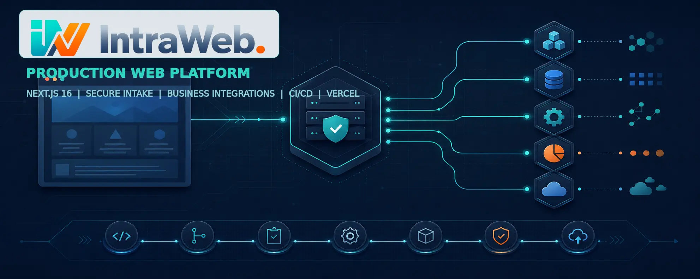
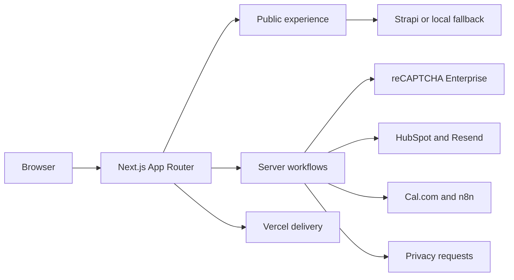

<p align="center">
  
</p>

# IntraWeb Technology Web Platform

[](https://nextjs.org/)
[](https://react.dev/)
[](https://www.typescriptlang.org/)
[](https://nodejs.org/)
[](https://vercel.com/)

The customer-facing production application for [IntraWeb Technology](https://www.intrawebtech.com/). It combines a responsive service experience with protected intake, CRM, email, scheduling, content, privacy, and automation workflows.

This app is maintained as `@repo/iw-site-q2` inside the [Nexus monorepo](../../README.md). Shared packages, integration contracts, CI configuration, and deployment rules remain versioned with the application.

## What this application does

| Area | Implementation |
| --- | --- |
| Public experience | Homepage, services, work, about, diagnostic, contact, start, blog, and legal routes |
| Lead intake | Zod-validated contact and website-intake workflows with reCAPTCHA Enterprise support |
| CRM | HubSpot contact upsert, intake persistence, and optional deal creation |
| Email | Transactional contact delivery through Resend |
| Scheduling | Cal.com availability and booking flows for diagnostic and kickoff calls |
| Automation | Authenticated outbound hooks for optional n8n workflows |
| Content | Shared Strapi client with hardcoded navigation, FAQ, and services fallbacks |
| Privacy | Data deletion request and confirmation workflow |
| Optional AI | Anthropic-assisted lead tier classification when configured; deterministic fallback otherwise |
| Delivery | Affected-package CI, Turborepo builds, and Vercel deployment configuration |

## Architecture



The application keeps three boundaries explicit:

1. **Public UI** presents the service model, proof, fit criteria, and conversion paths.
2. **Server route handlers** validate untrusted input and coordinate external systems without exposing server credentials to the browser.
3. **External services** remain configuration-driven so local development can render the public application without production secrets.

## Route map

### Public routes

| Route | Purpose |
| --- | --- |
| `/` | Recognition-led homepage and primary conversion path |
| `/services` | Engagement and service catalog |
| `/work` | Selected work and proof |
| `/about` | Company positioning and operating principles |
| `/diagnostic` | Diagnostic offer and scheduling path |
| `/contact` | Fit conversation and lead capture |
| `/start` | Structured website intake |
| `/blog` | Published content entry point |
| `/privacy`, `/terms` | Legal policies |
| `/data-deletion` | Privacy request workflow |

### Server routes

| Route | Responsibility |
| --- | --- |
| `POST /api/contact` | Validate contact submissions, coordinate CRM/email, and optionally notify n8n |
| `POST /api/website-intake` | Validate structured intake, synchronize HubSpot, optionally create a deal, and forward the workflow context |
| `GET /api/booking/slots` | Resolve available diagnostic booking slots |
| `POST /api/booking/book` | Create a diagnostic booking |
| `GET /api/kickoff/slots` | Resolve available kickoff slots |
| `POST /api/kickoff/book` | Create a kickoff booking and coordinate downstream updates |
| `POST /api/data-deletion/request` | Begin a privacy request workflow |
| `/api/preview`, `/api/exit-preview`, `/api/revalidate` | Control Strapi preview and revalidation |

## Technology

- Next.js 16 App Router and React 19
- TypeScript 5 and Tailwind CSS 4
- React Hook Form and Zod
- Google reCAPTCHA Enterprise
- HubSpot CRM, Resend, Cal.com, n8n, and Supabase
- Shared `@repo/strapi-client` content client
- Turborepo, GitHub Actions, and Vercel

## Local development

### Requirements

- Node.js 22
- pnpm 10.33.0

Run all commands from the Nexus repository root.

```bash
pnpm install
cp apps/iw-site-q2/.env.example apps/iw-site-q2/.env.local
pnpm --filter @repo/iw-site-q2 dev
```

Open [http://localhost:3010](http://localhost:3010).

The public application renders without third-party credentials. Routes that depend on email, CRM, scheduling, bot protection, or automation require their corresponding environment variables and may return a controlled error when those services are unavailable.

## Environment configuration

Use [`.env.example`](./.env.example) as the source of truth. Do not commit `.env.local` or provider credentials.

| Group | Representative variables |
| --- | --- |
| Site URLs | `NEXT_PUBLIC_SITE_URL`, `NEXT_PUBLIC_ACCOUNTS_URL` |
| Strapi | `STRAPI_URL`, `STRAPI_API_TOKEN`, `STRAPI_PREVIEW_SECRET`, `STRAPI_WEBHOOK_SECRET` |
| reCAPTCHA | `NEXT_PUBLIC_RECAPTCHA_SITE_KEY`, `RECAPTCHA_ENTERPRISE_PROJECT_ID`, `GOOGLE_APPLICATION_CREDENTIALS_JSON` |
| HubSpot | `HUBSPOT_ACCESS_TOKEN`, pipeline, stage, owner, and property mappings |
| Resend | `RESEND_API_KEY`, `CONTACT_EMAIL` |
| n8n | Webhook URLs, shared secrets, header name, and timeout settings |
| Cal.com | API key, event type IDs, organization slug, and public calendar links |
| Supabase/privacy | `SUPABASE_URL`, `SUPABASE_SERVICE_ROLE_KEY`, deletion workflow secrets |
| Optional classification | `ANTHROPIC_API_KEY` |

Variables prefixed with `NEXT_PUBLIC_` are browser-visible. All tokens, signing secrets, service-role credentials, and provider API keys must remain server-only.

## Validation

```bash
pnpm --filter @repo/iw-site-q2 lint
pnpm --filter @repo/iw-site-q2 check-types
pnpm --filter @repo/iw-site-q2 test
pnpm --filter @repo/iw-site-q2 build
```

The current package tests cover data deletion behavior, Strapi behavior, and server-only Strapi secret handling. They are targeted tests, not a claim of exhaustive application coverage.

Repository CI determines the affected workspace scope and runs lint, type checks, tests, and production builds. The stable `CI Gate` job is the protected-branch status check. Atlas-specific Playwright jobs do not imply Playwright coverage for this application.

## Deployment

[`vercel.json`](./vercel.json) configures the application as a monorepo-aware Vercel project:

- installs only the app and its workspace dependency closure;
- builds `@repo/iw-site-q2` through Turborepo;
- uses Turborepo's affected query to skip deployments when the app is unchanged.

GitHub's manual deployment workflow also exposes `iw-site-q2` as a selectable Vercel target. Environment variables are managed by the deployment platform and must not be stored in the repository.

## Security boundaries

- Zod validates external form payloads before provider calls.
- reCAPTCHA assessments verify token validity, expected action, and risk score when configured.
- The structured website-intake route fails closed in production if reCAPTCHA is not configured.
- Test-only bypasses require explicit secrets and constant-time comparison. They must not be enabled as normal production behavior.
- The website-intake flow removes the reCAPTCHA token before forwarding data to n8n.
- Security headers include CSP, HSTS, clickjacking protection, MIME sniffing protection, and a restrictive permissions policy.
- Server-only secrets never use the `NEXT_PUBLIC_` prefix.

## Project structure

```text
apps/iw-site-q2/
├── app/                 # App Router pages, layouts, metadata, and route handlers
├── components/          # Page sections, forms, navigation, and shared UI
├── lib/                 # Provider clients, validation, content, security, and workflow logic
├── public/              # Production media and static assets
├── docs/                # Application doctrine and implementation governance
├── .env.example         # Environment contract
├── next.config.mjs      # Next.js and security-header configuration
├── package.json         # Package commands and dependency contract
└── vercel.json          # Monorepo-aware Vercel build configuration
```

## Engineering documentation

- [Integration map](../../docs/architecture/integration-map.md)
- [Webhook contracts](../../docs/architecture/webhook-contracts.md)
- [Implementation governance](./docs/implementation-governance/START-HERE.md)
- [Application architecture doctrine](./docs/doctrine/intrawebtech-site-architecture.md)
- [Repository environment contract](../../.env.example)

## Working in this package

- Keep provider credentials and private customer data out of commits, fixtures, logs, screenshots, and documentation.
- Update `.env.example` and the relevant architecture contract when an integration changes.
- Preserve the documented content fallbacks unless the change explicitly replaces that resilience model.
- Run the package validation commands before opening a pull request.
- Keep application-specific documentation here and cross-application contracts under the Nexus `docs/` directory.
