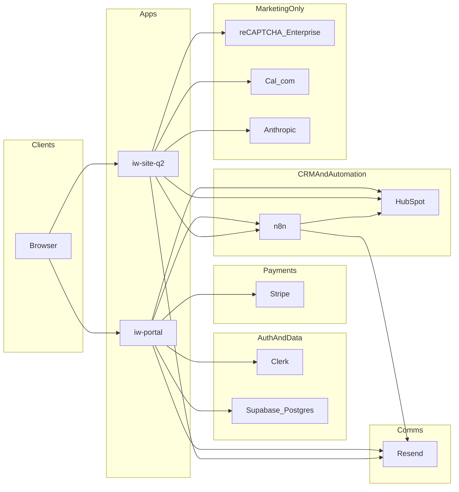

# System overview

## Monorepo purpose

Nexus is the pnpm + Turborepo monorepo for IntraWeb Technologies. It hosts the **client portal**, the **production marketing site**, shared **n8n workflow assets**, and shared **ESLint/TypeScript** configuration. The goal is a single place to evolve the internal operating platform without duplicating integration logic across ad-hoc repos.

## Active apps

| App | Role |
| --- | --- |
| **iw-portal** (`@repo/iw-portal`) | Authenticated client dashboard: projects, billing, documents, milestones, messages, change orders; receives webhooks from Clerk, Stripe, HubSpot, and n8n. |
| **iw-site-q2** (`@repo/iw-site-q2`) | Public marketing site: contact form, website intake, kickoff booking; uses reCAPTCHA Enterprise, Cal.com, Resend, HubSpot, and optional n8n webhooks. |

**Legacy:** `apps/iw-site` is excluded from the workspace and should not be used for new work.

## Package responsibilities

| Package | Responsibility |
| --- | --- |
| `@repo/n8n-workflows` | Checked-in workflow JSON, documentation (RUNBOOK, STAGES), and scripts to pull/push/sync workflows via n8n API. |
| `@repo/eslint-config` | Shared lint rules for Next.js and internal packages. |
| `@repo/typescript-config` | Base `tsconfig` fragments for consistent compiler settings. |

See [architecture-inventory.md](./architecture-inventory.md) for scripts and touchpoint lists.

## System diagram

n8n workflows may also use **Google Drive** and other nodes with credentials stored in n8n (not in app env). See [integration-map.md](./integration-map.md).

## Production-critical flows

1. **Portal authentication** — Clerk sessions; satellite/proxy settings for dashboard domain; Clerk webhooks for user lifecycle and provisioning hooks.
2. **Portal billing** — Stripe Checkout and customer portal; Stripe webhooks to mark invoices paid and sync subscription-related state; optional n8n notifications.
3. **Client provisioning** — n8n `POST` to `/api/webhook/n8n` with shared secret header; Supabase writes for projects, milestones, invoices; idempotency around HubSpot deal / project linkage (see portal tests and n8n docs).
4. **HubSpot sync** — Normalized payloads and legacy batch shapes to `/api/webhook/hubspot`; CRM mirror and deal stage / portal plan updates.
5. **Marketing intake** — Contact and website-intake API routes: reCAPTCHA verification, HubSpot create/update, optional n8n fan-out; kickoff booking writes HubSpot properties and may call n8n.

For webhook details, see [webhook-contracts.md](./webhook-contracts.md). For environment variables, see [environment-contract.md](./environment-contract.md).
