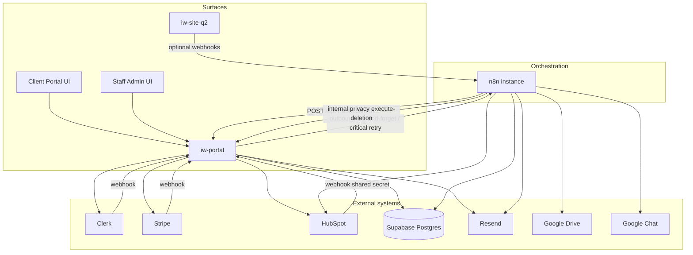

# Nexus ↔ n8n integration map

**Evidence:** `apps/iw-portal/src/lib/n8n/client.ts`, `apps/iw-portal/src/app/api/webhook/n8n/route.ts`, curated workflows under `packages/n8n-workflows/`, `docs/architecture/webhook-contracts.md`, `apps/iw-portal/docs/n8n-integration.md`  
**Date:** 2026-07-30  

Trust boundary: shared header `x-intrawebtech-secret` ↔ `WEBHOOK_SECRET` (portal). Marketing site uses a **separate** `MARKETING_N8N_WEBHOOK_SECRET` / configurable header.

---

## System diagram (verified)

---

## n8n → portal (inbound)

| Workflow / path | Portal action | Status |
| --- | --- | --- |
| Qualified to Buy → Portal + Clerk | `provision_client`, `add_invoice` | Partially Implemented (drift) |
| Proposal and Contract Delivery | `attach_project_document` | Partially Implemented (drift) |
| HubSpot invoice → add_invoice | `add_invoice` | Partially Implemented (**secret header defect**) |
| Data Deletion Handler | `/api/internal/privacy/execute-deletion` | Partially Implemented (empty ID; proxy may block) |

Inbound router: `POST /api/webhook/n8n` supports additional actions (`link_portal_clerk_user`, `update_milestone`, `update_change_order`, `log_activity`, documents/messages/notifications) — see route implementation for the full action switch.

---

## Portal → n8n (outbound)

From `src/lib/n8n/client.ts` (paths relative to `N8N_BASE_URL`):

| Event helper | Path | Dispatch style | Curated receiver |
| --- | --- | --- | --- |
| `triggerStaffAlert` | `/webhook/portal-message-received` | fire-and-forget | **None found** |
| `triggerLoginEvent` | `/webhook/portal-login` | critical (1 retry) | **None found** |
| Document request | `/webhook/portal-document-request` | fire-and-forget | **None found** |
| Invoice paid | `/webhook/portal-invoice-paid` | critical | **None found** |
| Stripe catalog checkout | `/webhook/portal-stripe-catalog-payment` | (per client) | **None found** (TS doc artifact only) |
| Stripe subscription sync | `/webhook/portal-stripe-subscription-sync` | critical | Curated JSON **Unverified** (no ID) |
| Document signed | `/webhook/portal-document-signed` | fire-and-forget | **None found** |
| Milestone approved | `/webhook/portal-milestone-approved` | fire-and-forget | **None found** |
| Change order | `/webhook/portal-change-order` | fire-and-forget | **None found** |
| Proposal lifecycle | `/webhook/portal-proposal-lifecycle` | gated by env | **None found** |

**Implication for portfolio/docs:** Portal *emits* a rich event surface; only a subset of receivers are checked in. Do not claim end-to-end automation for orphaned paths.

---

## Marketing → n8n

| Source | Typical path | Status |
| --- | --- | --- |
| Contact / website intake | configurable `N8N_CONTACT_WEBHOOK_URL` | Implemented in site; receiver often Website Form Lead Intake |
| Kickoff booked | `N8N_KICKOFF_BOOKED_WEBHOOK_URL` / `kickoff-booked` | Planned/partial receiver |

---

## Human approval / async

| Concern | Where it lives |
| --- | --- |
| Proposal approve/reject | Client portal UI → API → HubSpot note / OS queue / optional n8n |
| Milestone approval | Client portal |
| Change-order staff review | Admin UI |
| Contract/proposal PDF queues | Supabase OS tables + n8n generation workflows |
| Social Ops editorial review | Experimental admin UI + outbox (portal cron every 3 minutes in `vercel.json`) |
| Long-running sequences | n8n Wait nodes (outreach, invoice reminders, onboarding, referral) |

---

## Failure surfacing

| Layer | Mechanism |
| --- | --- |
| Portal | `integration_events`, admin Integrations console (status-only “replay”) |
| n8n | Per-node continue-on-error; shared Google Chat / Resend alert subworkflows (inconsistent adoption) |
| Social ops | Outbox status + review action history |

---

## Credentials / env (names only)

- Portal: `N8N_BASE_URL`, `N8N_API_URL`, `N8N_API_KEY`, `WEBHOOK_SECRET`, proposal lifecycle enable flag  
- Marketing: `MARKETING_N8N_WEBHOOK_SECRET`, contact/kickoff webhook URLs  
- n8n: HubSpot / Supabase / Anthropic / Resend / Twilio / Google Drive / n8n API credentials by display name (inconsistent naming across workflows)

Never commit live secret values into docs or portfolio content.
