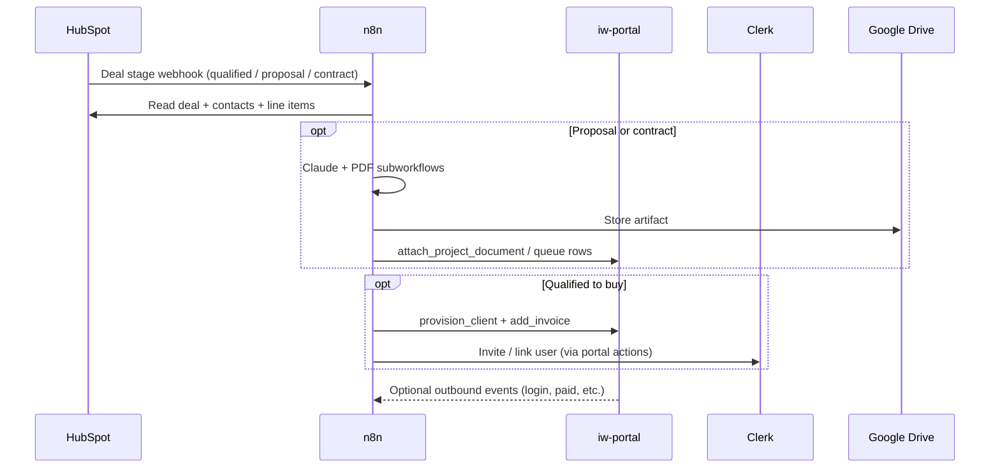

# Automations — architecture

## Separation of responsibilities

| Concern | Owner |
| --- | --- |
| Client-visible delivery state | Portal + Supabase (RLS-intended; server often service-role) |
| Staff review UI | Portal admin |
| CRM commercial spine | HubSpot |
| Payments | Stripe (+ portal invoice rows) |
| Multi-step orchestration, waits, AI document generation | n8n |
| Transactional email/SMS from automations | Resend / Twilio via subworkflows |

## Trigger patterns

1. **Webhook** — CRM stage, marketing forms, Cal.com, portal outbound events, voice providers  
2. **Schedule** — health scoring, weekly updates, reporting, content pipeline, backups  
3. **Subworkflow** — reusable Claude, PDF, HubSpot contact/deal, notifications  
4. **HubSpot app trigger** — e.g. intake brief on contact events  

## Data flow (canonical sales path)

## Idempotency and duplicates

- Portal provisioning includes idempotency tests around HubSpot deal / project linkage (`provision-client-idempotency` tests).
- Many n8n workflows lack explicit idempotency keys; HubSpot search-before-create patterns reduce some duplicates.
- Social ops ingest uses idempotent draft keys (portal experimental path).

## Human-in-the-loop

- Portal: proposals, milestones, change orders, Social Ops review (experimental).
- n8n: long Wait-based sequences; approval queues in Supabase OS tables for generated contracts/proposals.

## Known architectural gaps

- Orphan portal → n8n paths (no curated receivers).
- Curated JSON can diverge from live n8n (`_synced-from-n8n` drift).
- Mixed credential display names and hard-coded hosts reduce environment portability.
