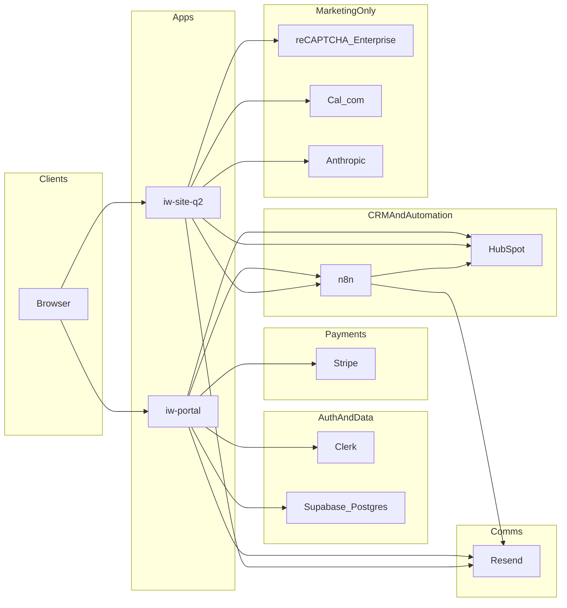

# IntraWeb Technology Platform — Product Dossier

**Monorepo:** Nexus (`IntraWeb-Technology/nexus`)  
**Status labels:** Implemented · In progress · Planned · Legacy · Schema only  
**Snapshot:** July 2026 (repo inspection + architecture docs)  
**Audience:** founders, operators, partners, and internal handoff

> Distinguish **Implemented** (runnable code in production apps) from **Planned** / **In progress** when speaking externally. Social Ops slice 1 may be coded but not yet migrated in every environment.

---

## How to read status

| Label | Meaning |
|-------|---------|
| **Implemented** | Runnable app code / routes / migrations in active apps |
| **In progress** | Coded vertical slice or partial product surface |
| **Planned** | Documented intent, deferred, or placeholder only |
| **Legacy** | On disk but excluded from workspace / not production |
| **Schema only** | Tables/roles exist with little or no full product UX |

---

## 1. Executive Summary

### What is the platform?

Nexus is IntraWeb’s operating platform: a **multi-tenant client portal** (`iw-portal`), a **public marketing site** (`iw-site-q2`), and an **n8n automation layer** that connects Clerk, Supabase, Stripe, HubSpot, and email into one delivery OS.

Company positioning (doctrine): IntraWeb builds the **operational infrastructure** that connects how a company works to how it scales — not an agency pitch, SaaS lock-in product, or automation-as-the-product vendor.

### What business problem does it solve?

Growing operators (roughly **20–150 people**) hit workflow friction: systems that don’t talk, handoffs that break, and delivery that lives in inboxes and spreadsheets instead of durable infrastructure.

- The **portal** gives clients one place for projects, billing, documents, messaging, and approvals.
- **Marketing + n8n** turn inbound interest into CRM deals, kickoffs, and provisioned portal workspaces.

### Who is the target audience?

| Segment | Who |
|---------|-----|
| **Buyers** | Founders / ops leaders at scaling SMBs (logistics, manufacturing, distribution, services) |
| **Portal users** | IntraWeb clients (project owners, billing contacts) |
| **Admin users** | IntraWeb staff (`admin` / `ops` / `support` / `viewer`) |

### Current development status

| Area | Status |
|------|--------|
| Portal core + staff admin OS | **Implemented** |
| Marketing site + conversion funnel | **Implemented** (production: `www.intrawebtech.com`) |
| Social Ops vertical slice 1 (ingest, review UI, outbox cron) | **In progress** |
| Auto-publish, blog content, Operational Records detail, Agent OS runtime | **Planned** |
| Lint / check-types / build gates | **Pass** (per architecture hardening docs) |
| RC tag `v0.1.0-rc.1` | **Blocked** pending full form → n8n → HubSpot → Supabase smoke |

---

## 2. Architecture

### High-level architecture diagram

Source: `docs/architecture/system-overview.md`. Google Drive credentials live in n8n, not app env.

### Stack by layer

| Layer | Choice | Status | Notes |
|-------|--------|--------|-------|
| Frontend | Next.js 16.2 + React 19 + Tailwind CSS v4 | Implemented | App Router; portal `@/` → `src/*`, site `@/` → app root |
| Backend | Next.js Route Handlers + Server Components | Implemented | No separate API service; webhooks colocated |
| Database | Supabase Postgres + Storage + RLS | Implemented | 19 migrations; Clerk JWT for RLS; service role for staff/webhooks |
| Authentication | Clerk (satellite/proxy for portal domains) | Implemented | `accounts.*` primary; portal/dashboard satellites |
| Authorization | `staff_users` + client/project members + RLS | Implemented | Staff: admin\|ops\|support\|viewer |
| Deployment | Vercel (2 primary projects) + Turbo monorepo | Implemented | `nexus-iw-portal`, `iw-site-q2` |
| Infrastructure | Managed Supabase + Hostinger n8n/VPS options | In progress | Self-host Supabase runbook exists; managed still primary |
| CI/CD | GitHub Actions → lint, check-types, build | Implemented | No deploy job; Vercel Git integration deploys |
| Automation | n8n (`@repo/n8n-workflows`) | Implemented | ~40 curated JSON + ~99 synced audit dump |

### Active monorepo apps

| App | Package | Role | Dev port |
|-----|---------|------|----------|
| `apps/iw-portal` | `@repo/iw-portal` | Client + staff portal | 3002 |
| `apps/iw-site-q2` | `@repo/iw-site-q2` | Production marketing site | 3010 |
| `apps/iw-site` | — | Legacy marketing | Excluded from workspace |
| `apps/ai-ops` | — | Agent OS docs only | No `package.json` |

### Packages

| Package | Status | Purpose |
|---------|--------|---------|
| `@repo/n8n-workflows` | Implemented | Workflow JSON + pull/sync/push |
| `@repo/ops` | Implemented | Vercel env sync, stack diagnostics |
| `@repo/env` | Implemented | Zod env validation (scripts only today) |
| `@repo/integrations` | Planned / scaffold | Placeholders that throw; SDKs still in apps |
| `@repo/eslint-config` | Implemented | Shared ESLint |
| `@repo/typescript-config` | Implemented | Shared tsconfig fragments |

---

## 3. Public Website (`iw-site-q2`)

**Production URL:** https://intrawebtech.com  
**Legacy:** `apps/iw-site` (do not demo as current)  
**Prototype only:** `apps/iw-site-q2/intraweb-tech-website` (design handoff)

### Pages

| Page | Purpose | Audience | Primary CTA | Key functionality | Status |
|------|---------|----------|-------------|-------------------|--------|
| `/` | Recognition homepage (friction → proof → model → fit) | Ops founders 20–150 | Book a Systems Call → `/contact` | Hero, friction grid, proof, model, fit, final CTA + JSON-LD | Implemented |
| `/services` | Engagement catalog | Scope seekers | Diagnostic / contact | Service cards + FAQ + schema | Implemented |
| `/diagnostic` | AI Workflow Diagnostic offer | High-intent buyers | Book via Cal.com embed | Deliverables, fit, HowTo/FAQ schema | Implemented |
| `/contact` | Fit conversation intake | Ready-to-talk | Submit form | reCAPTCHA → HubSpot → Resend → optional n8n; Anthropic when keyed | Implemented |
| `/about` | Operator trust / origin | Verifiers | Systems Call → `/contact` | Principles, how we work, Person JSON-LD | Implemented |
| `/work` | Proof / case studies shell | Trust-seekers | Book Diagnostic | Shell live; Operational Records content planned | In progress |
| `/blog` | Thought leadership | Operators | Diagnostic | Coming-soon placeholder; not in sitemap | Planned |
| `/start` | Website / project intake | Web-build buyers | Complete intake | Multi-step form → HubSpot deal + n8n | Implemented |
| `/thank-you` | Post-submit confirmation | Converters | Home | Utility confirmation | Implemented |
| `/privacy`, `/terms` | Legal | All visitors | — | Policy pages | Implemented |
| `/data-deletion` (+ `/confirm`) | Privacy DSR | Data subjects | Submit / confirm token | reCAPTCHA + deletion request APIs | Implemented |

### Components & SEO

- **Components (~62 files):** `HomeHeroSection`, `FrictionSection`, Argument/Proof/Model/Fit, `FinalCTA`, `WebsiteIntakeForm`, `KickoffScheduler`, legal layout, `JsonLd`, nav.
- **SEO:** `lib/seo-meta.ts` (title, description, keywords, canonical, OG 1200×630, Twitter). JSON-LD for WebSite/WebPage/Service/FAQ/Person/HowTo. `public/robots.txt` + sitemap (core URLs: `/`, `/services`, `/diagnostic`, `/about`, `/work`, `/contact`).
- **Planned:** problem-first services IA, full Operational Records system, blog posts; About meta still has some “AI studio” wording drift vs doctrine.

### Marketing API routes (Implemented)

| Path | Purpose |
|------|---------|
| `/api/contact` | Systems Call / contact funnel |
| `/api/website-intake` | `/start` intake |
| `/api/kickoff/book`, `/api/kickoff/slots` | Kickoff booking |
| `/api/booking/book`, `/api/booking/slots` | Diagnostic booking |
| `/api/data-deletion/request` | DSR pipeline |

---

## 4. Admin Dashboard

Staff-only (`/admin/*`). Roles via `staff_users`: **admin**, **ops**, **support**, **viewer**.

| Module | Purpose | Features | Roles | Key APIs / data | Status |
|--------|---------|----------|-------|-----------------|--------|
| Overview | Command home | Counts, recent messages, health entry | All staff | Admin queries | Implemented |
| Operations Queue | Work queue | At-risk projects, pending COs | ops+ | `os_contracts_queue`, `/api/internal/os/*` | Implemented |
| Social Review | Editorial approval | Approve / rewrite / skip | staff | `/api/admin/social-ops/reviews*` | In progress |
| Data Health | Integrity checks | Missing refs + findings | ops+ | `data_health_checks` | Implemented |
| Integrations | Event visibility | integration_events + replay | ops+ | Webhook event log | Implemented |
| Clients | Client CRM mirror | List + detail, notes, memberships | staff | `clients`, HubSpot IDs | Implemented |
| Projects | Project oversight | Status, plan, deal link | staff | `projects` | Implemented |
| Message Triage | Staff inbox | Unread client threads | support+ | `messages`, n8n notify | Implemented |
| Change Orders | Scope governance | Review contractual COs | ops+ | `change_orders`, HubSpot CO form, PDF | Implemented |
| Billing | Invoice / sub oversight | Portal invoices + Stripe state | ops+ | `invoices`, `subscriptions` | Implemented |
| OS Data | Automation warehouse UI | Deals, leads, automation log, contracts | ops+ | `os_*` tables | Implemented |
| Settings | Staff + flags | Role edits, feature flags | admin for mutations | `requireAdmin`, `staff_audit_log` | Implemented |

**Screens:** `/admin`, `/admin/operations`, `/admin/social-ops`, `/admin/data-health`, `/admin/integrations`, `/admin/clients`, `/admin/clients/[clientId]`, `/admin/projects`, `/admin/messages`, `/admin/change-orders`, `/admin/billing`, `/admin/os`, `/admin/settings`.

**Permissions:** `apps/iw-portal/src/lib/admin/auth.ts` (`requireStaff`, `requireAdmin`, `canMutateStaff`). Bootstrap via Clerk org admin and/or `STAFF_EMAIL(S)`.

---

## 5. Client Portal

| Feature | What clients get | Status | Notes |
|---------|------------------|--------|-------|
| Authentication | Clerk sign-in/up; post-auth → dashboard or admin | Implemented | Satellite domains + optional FAPI proxy |
| Dashboard | Greeting, plan, progress, quick links, live cards | Implemented | HubSpot merge for invoices/line items when configured |
| Project management | Timeline, milestones, proposals, phase approve, project switcher | Implemented | `/progress`, `/scope`, multi-project bundle |
| Messaging | Staff ↔ client threads | Implemented | `POST /api/messages` → n8n |
| Documents | List, download, e-sign, document request | Implemented | Signature audit fields; PDFKit where needed |
| Billing | Invoices, Stripe Checkout, customer portal, maintenance, payment method | Implemented | Webhook sync + HubSpot via n8n |
| Notifications | In-app notifications + preferences | Implemented | `/notifications`; `/activity` redirects here |
| File uploads | Private Storage `client-uploads` (10MB; pdf/doc/png/jpg/zip) | Implemented | Path scoped to owned `project_id` |
| Settings | Account + notification preferences | Implemented | `/settings` |
| Change orders | Request contractual scope changes + PDF | Implemented | HubSpot CO form + n8n |
| Help & FAQ | Self-serve accordion | Implemented | `/help` |
| AI capabilities | None in portal app | Planned | Anthropic is marketing-site only |
| Client multi-member RBAC UX | `owner` / `billing` / `approver` / `viewer` tables | Schema only | Light product UI vs full invite/role console |

---

## 6. Feature Inventory

### Completed (Implemented)

- Client portal core (dashboard, progress, messages, docs, billing, change orders, settings, help)
- Staff admin console (12 modules)
- Clerk + Supabase RLS + Stripe + HubSpot + Resend + n8n webhooks
- Marketing site + contact / intake / kickoff / DSR APIs
- CI lint / typecheck / build · Turbo · Vercel dual-app deploy
- OS data warehouse tables + contracts queue
- Privacy deletion request flow (site + portal internal API)

### In progress

- Social Ops slice 1: tables, ingest RPC, outbox cron, admin review UI
- Google Chat outbox handler (no quick actions yet)
- Postiz draft fields (no auto-publish)
- `/work` page shell awaiting Operational Records content
- Supabase self-host Hostinger path (runbook; managed primary)
- `@repo/env` / `@repo/ops` consolidation for remaining scripts

### Planned

- Social auto-publish on approval + curated `07_social` workflows
- Blog content · Operational Records detail pages
- Services problem-first IA
- Full client multi-member RBAC product UX
- Real `@repo/integrations` SDK wrappers
- Agent OS runtime beyond docs (`apps/ai-ops`)
- Portal-side AI assistant (not started)
- CI deploy automation; fix/ignore misconfigured root Vercel project `nexus`

---

## 7. Technical Highlights

| Area | Implementation | Status |
|------|----------------|--------|
| Authentication | Clerk Next.js SDK; Svix webhooks; JWT template for Supabase | Implemented |
| RBAC | Staff roles in Postgres; org:admin bootstrap; `STAFF_EMAIL` allowlist; audit log | Implemented |
| Multi-tenancy | Client-scoped via `clerk_user_id` / `project_ids_for_user()` RLS — not org SaaS tenancy | Implemented |
| API architecture | Colocated Route Handlers: `/api/billing\|documents\|webhook\|internal\|admin` | Implemented |
| Component library | Per-app `ui/` + portal/admin components (not a shared package) | Implemented |
| Design system | CSS variables (`--iw-*`) + Tailwind v4; marketing doctrine-governed visuals | Implemented |
| State management | Server Components + fetch; minimal client state | Implemented |
| Error handling | Zod validation; HubSpot error boundary; webhook signatures; `/api/health` | Implemented |
| Testing | `tsx --test`: provision idempotency, privacy tier, social-ops (+ site data-deletion) | In progress |
| Logging | Staff audit log; `integration_events`; `os_automation_log`; ops diagnostics | Implemented |
| Analytics | Marketing gtag (`NEXT_PUBLIC_GA_ID`); no full product analytics suite | In progress |
| Performance | RSC; Turbo cache; Storage size limits; cron outbox batching | Implemented |

---

## 8. Engineering Decisions

> Formal ADRs are mostly empty (`ADR_TEMPLATE` only). Rationale below is inferred from runbooks, README, and implemented architecture — say so when speaking externally if primary-source ADRs are required.

| Decision | Why (as implemented) | Tradeoff |
|----------|----------------------|----------|
| **Why Next.js?** | One runtime for marketing SSR/SEO and authenticated portal; App Router colocates APIs with UI; Vercel-native | No separate Nest/FastAPI service — webhook/business logic lives in the app |
| **Why Supabase/Postgres?** | RLS + Storage + SQL migrations fit multi-client portal; service role for automation; Clerk JWT bridge | Auth is Clerk, not Supabase Auth — two identity systems to keep aligned |
| **Why Clerk?** | Hosted auth, satellite domains for portal/dashboard/accounts, org roles for staff bootstrap | Satellite/proxy/DNS misconfig causes redirect loops (heavily documented in portal README) |
| **Why Vercel dual projects?** | Isolate marketing vs portal envs/builds; per-app `vercel.json` with monorepo install from root | Root Vercel project misconfig risk; Root Directory must be set correctly per app |
| **Why n8n?** | Orchestrate HubSpot/Drive/email/provisioning without rebuilding every integration in app code | Logic split across app + workflows; credential rotation is an ops concern on n8n |

---

## 9. Integrations

| Integration | Used by | Purpose | Status | Runtime risk |
|-------------|---------|---------|--------|--------------|
| Clerk | portal | Auth, webhooks, JWT → Supabase | Implemented | High |
| Supabase | portal | Postgres, RLS, Storage uploads | Implemented | High |
| Stripe | portal | Checkout, invoices, subscriptions, webhooks | Implemented | High |
| HubSpot | portal + site | CRM contacts/deals/forms/mirror | Implemented | High |
| n8n | portal + site + package | Provisioning, notifications, OS pipelines | Implemented | High |
| Resend | portal + site | Transactional email | Implemented | Medium |
| Cal.com | site | Diagnostic/kickoff scheduling | Implemented | Medium |
| reCAPTCHA Enterprise | site | Bot protection on forms | Implemented | Medium |
| Anthropic | site | Contact flow assist when keyed | Implemented | Low–Med |
| Google Drive | n8n only | Client folders / doc generation | Implemented | Medium |
| Postiz | social-ops | Draft publish target | In progress | Medium |
| Google Chat | social-ops outbox | Staff alerts / future quick actions | In progress | Low |
| OpenAI | — | Not a first-class portal/site dependency | Planned | — |
| GitHub | CI | Actions on `main` / `development` | Implemented | Low |
| Vercel | both apps | Hosting, env, cron | Implemented | High |

### Portal ↔ n8n outbound webhooks (Implemented)

| Path | Trigger |
|------|---------|
| `/webhook/portal-message-received` | Client sends a message |
| `/webhook/portal-login` | Client login |
| `/webhook/portal-document-request` | Document request |
| `/webhook/portal-invoice-paid` | Invoice paid via Stripe |
| `/webhook/portal-stripe-catalog-payment` | Catalog Payment Link checkout |
| `/webhook/portal-change-order` | Contractual change order submitted |

Inbound: `POST /api/webhook/n8n` with `x-intrawebtech-secret` (actions include provision_client, add_invoice, update_milestone, etc.).

---

## 10. Metrics (repo facts)

| Metric | Count | Source |
|--------|------:|--------|
| Portal pages (`page.tsx`) | 30–31 | `apps/iw-portal/src/app` |
| Marketing pages (`page.tsx`) | 13 | `apps/iw-site-q2/app` |
| Portal API routes | 36 | `src/app/api/**/route.ts` |
| Marketing API routes | 7 | `app/api/**/route.ts` |
| Portal components (~files) | ~52–54 | `src/components` |
| Site components (~files) | ~62 | `components/` |
| SQL migrations | 19 | `001`–`019` |
| `CREATE TABLE` statements | ~45 | migrations (incl. `os_*` + social) |
| Curated n8n workflow JSON | ~39–43 | `packages/n8n-workflows/0*_` |
| Synced n8n dump JSON | ~99 | `_synced-from-n8n` |
| Background jobs | 1 Vercel cron (`*/3`) | social-ops outbox dispatch |
| Portal unit test files | 3 | `package.json` test script |
| CI workflows | 1 | `.github/workflows/ci.yml` |
| Active packages | 6 | env, ops, integrations, n8n, eslint, tsconfig |
| Build gate | PASS | lint + check-types + build |
| Test coverage % | Not measured | No coverage reporter configured |

### n8n curated categories (approx.)

| Folder | Count | Notes |
|--------|------:|-------|
| `01_lead-generation` | 7 | Kickoff, lead routing |
| `02_outreach` | 2 | Sequences / voice |
| `03_sales` | ~8–11 | Portal, Stripe, proposals |
| `04_onboarding` | 2 | Docs |
| `05_client-success` | 5 | Health, GDPR, unsubscribe |
| `06_content` | 1 | LinkedIn |
| `07_reporting` | 1 | Internal dashboard |
| `07_social` | 0 JSON | Ingest JS only; full workflows planned |
| `08_command-center` | 1 | Google Chat |
| `09_documentation` | 2 | Backup / OS manual |
| `_config` + `_subworkflows` | ~11 | Routers + shared |

---

## 11. Roadmap

### Current priorities

1. Complete Social Ops (auto-publish, Chat actions, curated `07_social` workflows)
2. Full form → n8n → HubSpot → Supabase smoke; then RC tag
3. Operational Records content for `/work`
4. Keep portal/admin reliability and env/stack alignment

### Planned features

- Blog posts
- Services problem-first restructuring
- Full client multi-member RBAC UX
- `@repo/integrations` real clients
- Remaining portal script migration into `@repo/ops`
- Optional Hostinger self-hosted Supabase cutover
- Agent OS orchestration beyond documentation

### Long-term vision

IntraWeb as the **operational infrastructure layer** — durable systems that connect how work happens to how the business scales, with the portal as the client-facing OS and n8n / Agent OS as the automation fabric.

---

## 12. Screenshots

| Surface | Capture status | Notes |
|---------|----------------|-------|
| Marketing home hero + friction grid | Inspected live | Brand: dark / white / orange; CTA “Book a Systems Call” |
| `/services` | Inspected live | Integrated packages Starter / Growth / Advanced |
| Portal + admin screens | Require auth | Capture from signed-in staff/client session before external pitches |

### Recommended screenshot list

1. Marketing home hero + friction grid (brand proof)
2. `/diagnostic` with Cal embed (conversion product)
3. `/start` intake multi-step (delivery productization)
4. Portal `/dashboard` (client value)
5. `/progress` milestone timeline + approve
6. `/billing` + invoice detail (Stripe)
7. `/documents` + signature modal
8. Admin `/operations` + `/os` (internal OS)
9. `/admin/social-ops` review queue (newest capability)
10. Admin `/clients/[id]` detail

---

## 13. Portfolio Assets

### Best workflow diagrams

- Architecture: mermaid in §2 / `docs/architecture/system-overview.md`
- Integration map: `docs/architecture/integration-map.md`
- Lead journey: Site form → HubSpot → n8n → portal provision
- Billing journey: Invoice → Stripe Checkout → webhook → n8n → HubSpot
- Change-order journey: Portal CO → PDF → HubSpot → staff admin
- Social Ops: n8n ingest → `review_item` → outbox → Chat/Postiz
- Auth journey: accounts sign-in → satellite session → dashboard

### Best code examples to cite

| Story | Path |
|-------|------|
| Staff RBAC | `apps/iw-portal/src/lib/admin/auth.ts` |
| Client RLS helpers | `apps/iw-portal/supabase/migrations/001_initial.sql`, `010_admin_staff.sql` |
| n8n outbound contract | `apps/iw-portal/src/lib/n8n/client.ts`, `apps/iw-portal/docs/n8n-integration.md` |
| Social Ops ingest/outbox | `apps/iw-portal/src/lib/social-ops/*`, migration `019` |
| Marketing SEO system | `apps/iw-site-q2/lib/seo-meta.ts` |
| Positioning doctrine | `apps/iw-site-q2/docs/doctrine/01-positioning-foundation.md` |

### Best user journeys to demo

1. **Prospect:** Home → friction recognition → Systems Call → thank-you / diagnostic book  
2. **Website buyer:** `/start` intake → HubSpot deal → kickoff  
3. **Client:** Sign-in → dashboard → progress approve → document sign → pay invoice  
4. **Staff:** Admin ops queue → message triage → change-order review → OS data  

---

## Appendix A — Portal API inventory (36 routes)

| Category | Paths |
|----------|-------|
| Health | `/api/health` |
| Webhooks | `/api/webhook/clerk`, `stripe`, `hubspot`, `n8n` |
| Billing | `create-checkout-session`, `create-balance-checkout`, `create-maintenance-checkout`, `customer-portal`, `payment-method`, `invoices/[id]/pdf` |
| Documents | `upload`, `upload/confirm`, `download`, `sign`, `document-request` |
| Change orders | `POST /change-orders`, `[id]/cancel`, `[id]/pdf` |
| Portal UX | `messages`, `milestones/approve`, `notifications/mark-all-read`, `proposals/decision` |
| Maintenance | `/api/maintenance/subscribe` |
| Internal OS | `automation-log`, `contracts-queue`, `deal/[dealId]`, `pre-call-intake`, `stripe/subscription-sync` |
| Privacy | `/api/internal/privacy/execute-deletion` |
| Social ops | `ingest`, `outbox/dispatch`, admin `reviews`, `reviews/[id]`, `reviews/[id]/actions` |
| Misc | `/api/os-queue/pdf` |

---

## Appendix B — Key database tables

**Portal core:** `clients`, `projects`, `milestones`, `messages`, `documents`, `invoices`, `activity_log`, `notifications`, `notification_preferences`, `notes`, `milestone_approvals`, `change_orders`, `subscriptions`

**Staff / tenancy:** `staff_users`, `staff_audit_log`, `client_members`, `project_members`, `staff_invites`, `client_invites`, `feature_flags`, `integration_events`, `data_health_checks`, `data_subject_requests`

**OS warehouse:** `os_automation_log`, `os_deals_sheet`, `os_leads`, `os_sheet_contacts`, `os_sheet_companies`, `os_contracts_queue`, `os_client_success_clients`, `os_linkedin_pipeline`, `os_pipeline_snapshots`, `os_summary_metrics`, `os_revenue_monthly`, `os_pre_call_intake`

**CRM mirror:** `hubspot_crm_entities`

**Social Ops (migration 019):** `canonical_content`, `platform_publication`, `review_item`, `review_action`, `outbox_event`

---

## Appendix C — Related docs

| Doc | Path |
|-----|------|
| System overview | `docs/architecture/system-overview.md` |
| Architecture inventory | `docs/architecture/architecture-inventory.md` |
| Integration map | `docs/architecture/integration-map.md` |
| Environment contract | `docs/architecture/environment-contract.md` |
| Deployment runbook | `docs/architecture/deployment-runbook.md` |
| Social Ops slice | `docs/architecture/social-ops-vertical-slice.md` |
| Portal n8n integration | `apps/iw-portal/docs/n8n-integration.md` |
| Admin bootstrap | `apps/iw-portal/docs/admin-bootstrap.md` |
| Positioning doctrine | `apps/iw-site-q2/docs/doctrine/01-positioning-foundation.md` |
| Monorepo README | `README.md` |

---

*Generated from Nexus monorepo facts. Re-verify Social Ops deploy status (migration `019`) before claiming production availability of that slice.*
